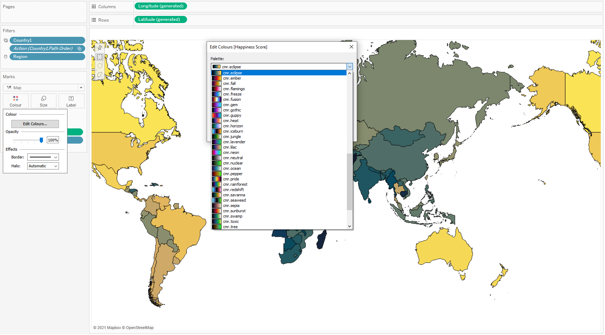

Tableau
=======
The following example shows how to create/update a Tableau preferences XML-file with Python that allows for the *CMasher* colormaps to be imported into the `Tableau`_ application.
If you use *CMasher* for your work in Tableau, then please star the `repo`_, and if you use *CMasher* in a scientific publication, please consider citing the *CMasher* paper using the BibTeX-entry found in the :ref:`community_guidelines`.

Big thanks to `@rdzudzar`_ for writing `this short tutorial <https://github.com/1313e/CMasher/issues/36>`_, which was adapted for inclusion in *CMasher* as the ``cmr app_usage tableau`` CLI-command.

.. _@rdzudzar: https://github.com/rdzudzar
.. _repo: https://github.com/1313e/CMasher
.. _Tableau: https://www.tableau.com

----

.. note::

    Before replacing or updating an existing Tableau preferences file, please back up the existing file.
    While the process described below should theoretically speaking never result in a preferences file that is formatted incorrectly, I cannot guarantee that this is always the case.
    If you do end up with an incorrectly formatted file, please open a `GitHub issue`_ about it.

First of all, we have to locate where Tableau stores its preferences file.
Usually, there should be a `My Tableau Repository` folder (or something similar) in your home or documents folder, which is where the preferences file is located.
If you have found this directory, but it does not contain a file called `Preferences.tps` yet (or you wish to replace the existing one), you can simply download a pre-generated preferences file `here <../../_static/Preferences.tps>`_ that is included with the docs and copy it to this directory.
Otherwise, we discuss below how to update the existing file to include all colormaps defined in *CMasher*.

Before we can update the existing file, we will need to make sure that *CMasher* is actually installed.
We can do that by simply checking if *CMasher*'s CLI-tools are currently available::

    $ cmr

If this results in the command not being understood, *CMasher* is currently not installed.
Please see the :ref:`introduction` for instructions on how to install *CMasher*.

After we have made sure that *CMasher* is installed, we can use the convenient CLI-command ``cmr app_usage tableau`` to either create a new preferences file or update the existing one in the directory we located earlier.
This CLI-command takes an existing Tableau preferences file, and updates it such that all *CMasher* colormaps are added to it without modifying any of the other content in the file.
The command can automatically detect if *CMasher* colormaps have been changed or renamed since the last time the command was executed, and will automatically modify the file accordingly.
Of course, in case the preferences file does not exist yet, a new file with just the colormaps will be created instead.
Simply execute the following to create or update an existing preferences file in the Tableau directory::

    $ cd /path/to/Tableau/directory
    $ cmr app_usage tableau
    Created/Updated Tableau preferences file in '/path/to/Tableau/directory'."

However, if you prefer to use a Python script for performing this action instead, the CLI-command is also available as :func:`~cmasher.app_usage.update_tableau_pref_file`:

.. code:: python

    >>> import cmasher as cmr
    >>> cmr.app_usage.update_tableau_pref_file("/path/to/Tableau/directory")

And that is all that is required to start using *CMasher*'s colormaps in Tableau.
Below is an image showing all the colormaps being available for use in Tableau, using their usual :pycode:`'cmr.'` prefix to avoid name clashes with other colormaps you may have added.

.. _GitHub issue: https://github.com/1313e/CMasher/issues
