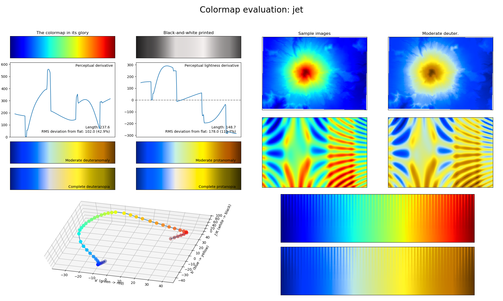

Background
==========
A good scientific colormap is often described/characterized as *perceptually uniform sequential*, which means that the colormap is perceived as uniformly changing in lightness and saturation, mostly at the same hue.
This allows for the data values of a plot to be interpreted correctly by the viewer without giving false information (a great explanation of this can be found `here <https://mycarta.wordpress.com/2012/10/14/the-rainbow-is-deadlong-live-the-rainbow-part-4-cie-lab-heated-body/>`_).
Such a colormap also often allows for a plot to be converted properly to grey-scale without losing information.
A perceptually uniform sequential colormap allows us to properly infer the relative order of the represented numerical values, without requiring a legend or colorbar.

Although this may sound easy enough, there are many colormaps out there that do this incorrectly.
The main issue usually is that humans do not perceive every color equally (e.g., small variations in the color green are not perceived as green is a common natural color, while small variations in the colors red and blue are perceived).
An example of a colormap that illustrates this issue, is the *jet* colormap:

    Output of the *viscm* package showing the statistics and performance of the *jet* colormap.
    The various different plots show how the colormap changes in perceived saturation and lightness, as well as how well the colormap converts to different types of color-vision deficiency and grey-scale.
    In case of a perceptually uniform sequential colormap, the two derivative plots should show a straight horizontal line; the colorspace diagram should be smooth; and the lines in the bottom-right corner plots should be visible up to the same depth across the entire colormap.

In :numref:`jet_viscm`, one can view the performance output of the *jet* colormap, made with the `viscm`_ package.
For perceptually uniform sequential colormaps, the two derivative plots in the top-left should show a straight horizontal line, indicating that the colormap changes uniformly in both perceived saturation and lightness.
Consequently, the colorspace diagram in the bottom-left should be smooth.
Finally, the lines in the bottom-right plots should be visible up to the same depth across the entire colormap, otherwise it can create artificial features as would be shown by the sample images in the top-right plots.
If the colormap is also required to be color-vision deficiency (CVD; color blindness) friendly, the requirements above apply to the deuteranomaly/protanomaly and deuteranopia/protanopia statistics as well.

Using this information, we can check the performance of the *jet* colormap as shown in :numref:`jet_viscm`.
The *jet* colormap shows the spectrum of visible light, which trivially increases linearly in wavelength.
However, in :numref:`jet_viscm`, we can see that this introduces multiple problems, as the color green is perceived as the brightest of the visible colors due to its natural occurrence, and the colormap is absolutely not CVD-friendly.
This is an example of a colormap where it would be necessary to have a colorbar/legend, and it is a poor choice for representing numerical values.

Despite all of these shortcomings, *jet* is still a commonly used colormap in the scientific literature.
An often cited reason for this (besides the general *"Everyone else uses it."*), is that *jet* has a high perceptual range, making it easier to distinguish adjacent values (*jet* has a higher perceptual range than all colormaps in *CMasher* except for :ref:`seasons` and :ref:`wildfire`, which are diverging colormaps).
Although a high perceptual range can be useful in many different cases, it certainly is not useful in all of them and there are ways to achieve this without giving false information.
In order to solve the problem of not knowing when to use what colormap, on the :ref:`usage`; :ref:`sequential`; and :ref:`diverging` pages, the different colormaps in *CMasher* are introduced and described what they should be used for, such that others can use them properly for their own projects.

.. _viscm: https://github.com/1313e/viscm
