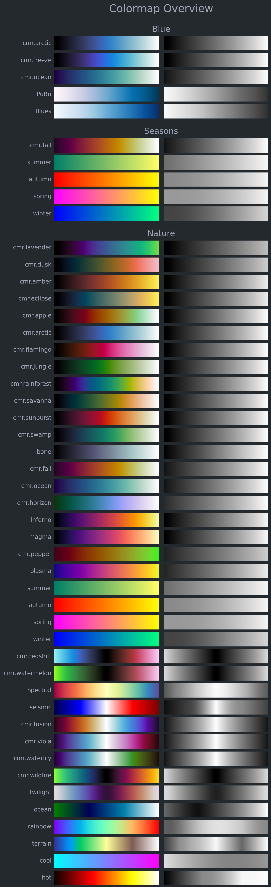

.. _cmap_overview_categories:

Colormap categories
===================
This colormap overview shows a collection of selected colormaps, divided into specified categories (determined at v1.4.0).
The overview uses dark mode and the colormaps are not sorted within each category.

.. code:: python

    # Import packages
    import cmasher as cmr

    # Create dict with a few specific categories for colormaps
    cmaps_dct = {
        'Blue': [
            'cmr.arctic',
            'cmr.freeze',
            'cmr.ocean',
            'PuBu',
            'Blues'],
        'Seasons': [
            'cmr.fall',
            'summer',
            'autumn',
            'spring',
            'winter'],
        'Nature': [
            'cmr.lavender',
            'cmr.dusk',
            'cmr.amber',
            'cmr.eclipse',
            'cmr.apple',
            'cmr.arctic',
            'cmr.flamingo',
            'cmr.jungle',
            'cmr.rainforest',
            'cmr.savanna',
            'cmr.sunburst',
            'cmr.swamp',
            'bone',
            'cmr.fall',
            'cmr.ocean',
            'cmr.horizon',
            'inferno',
            'magma',
            'cmr.pepper',
            'plasma',
            'summer',
            'autumn',
            'spring',
            'winter',
            'cmr.redshift',
            'cmr.watermelon',
            'Spectral',
            'seismic',
            'cmr.fusion',
            'cmr.viola',
            'cmr.waterlily',
            'cmr.wildfire',
            'twilight',
            'ocean',
            'rainbow',
            'terrain',
            'cool',
            'hot']}

    # Create colormap overview of selected colormaps, divided into categories
    cmr.create_cmap_overview(cmaps_dct, sort=None, dark_mode=True)
