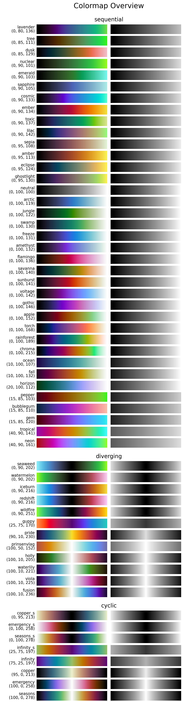

.. _cmap_overview_perceptual:

CMasher colormaps
=================
This colormap overview shows all colormaps in *CMasher*, similarly to as shown in :numref:`cmr_cmaps` on the :ref:`introduction` page.
The colormaps are sorted on their type and perceptual profile.
It also shows the lightness and perceptual info of each colormap.

.. code:: python

    # Import packages
    import cmasher as cmr

    # Create colormap overview of all colormaps in CMasher
    cmr.create_cmap_overview(sort='perceptual', show_info=True)
