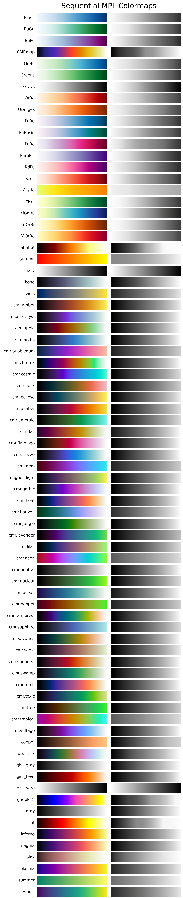

Sequential colormaps
====================
This colormap overview shows all sequential colormaps in *matplotlib* and *CMasher*.
The colormaps are sorted on their name (note that colormap types are not used).
The overview has its title set to :pycode:`"Sequential Colormaps"` instead of the default.

.. code:: python

    # Import packages
    import cmasher as cmr
    import matplotlib as mpl

    # Obtain all colormaps in MPL and CMasher that are sequential
    cmaps = [cmap for cmap in mpl.cm.cmap_d if cmr.get_cmap_type(cmap) == 'sequential']

    # Create colormap overview of all sequential colormaps in MPL and CMasher
    cmr.create_cmap_overview(cmaps, use_types=False, title="Sequential Colormaps")