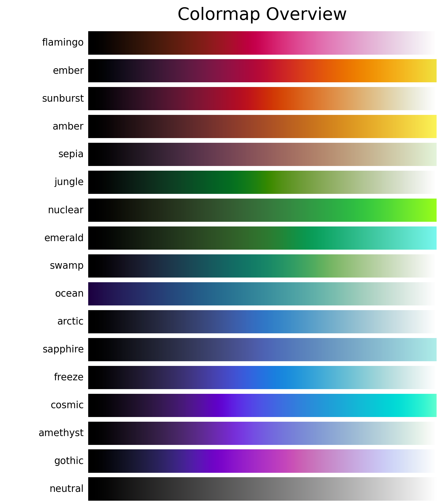

Single major colors
===================
This colormap overview shows a collection of colormaps in *CMasher* that only use a single major color (determined at v1.6.2).
The overview does not show the grayscale colormap versions and scales the colormap subplots to be twice as wide as usual.

.. code:: python

    # Import packages
    import cmasher as cmr

    # Create list with single major color colormaps
    cmaps_lst = [
        cmr.flamingo,
        cmr.ember,
        cmr.sunburst,
        cmr.amber,
        cmr.sepia,
        cmr.jungle,
        cmr.nuclear,
        cmr.emerald,
        cmr.swamp,
        cmr.ocean,
        cmr.arctic,
        cmr.sapphire,
        cmr.freeze,
        cmr.cosmic,
        cmr.amethyst,
        cmr.gothic,
        cmr.neutral]

    # Create colormap overview of selected colormaps with no grayscale subplots
    cmr.create_cmap_overview(cmaps_lst, use_types=False, sort=None,
                             show_grayscale=False, wscale=2)
