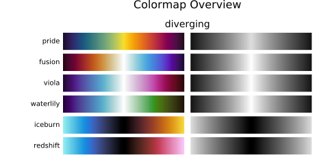
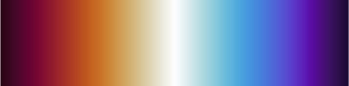
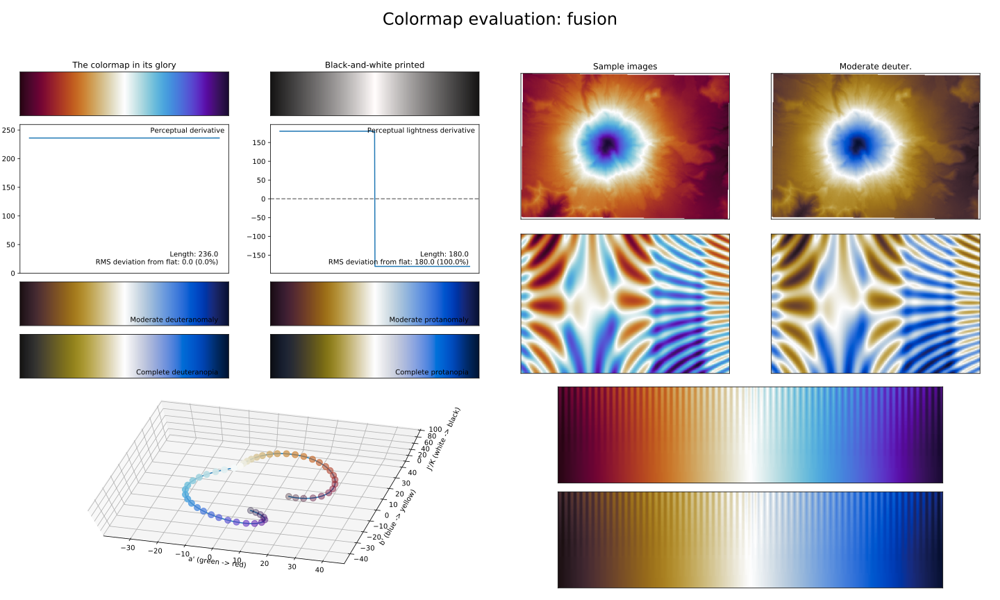
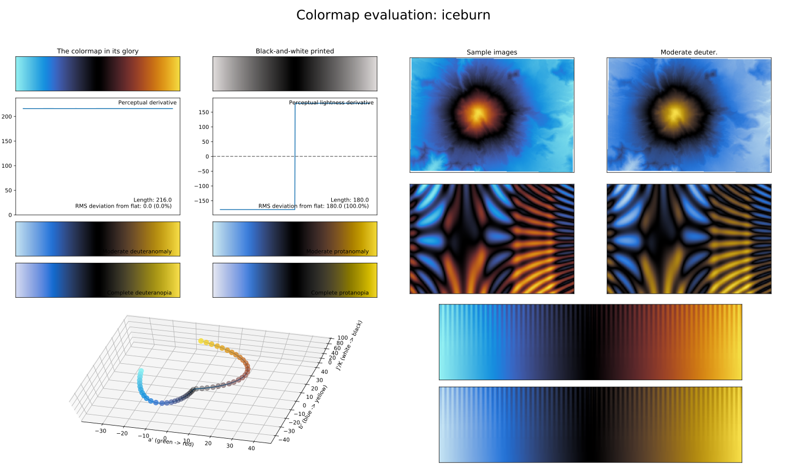
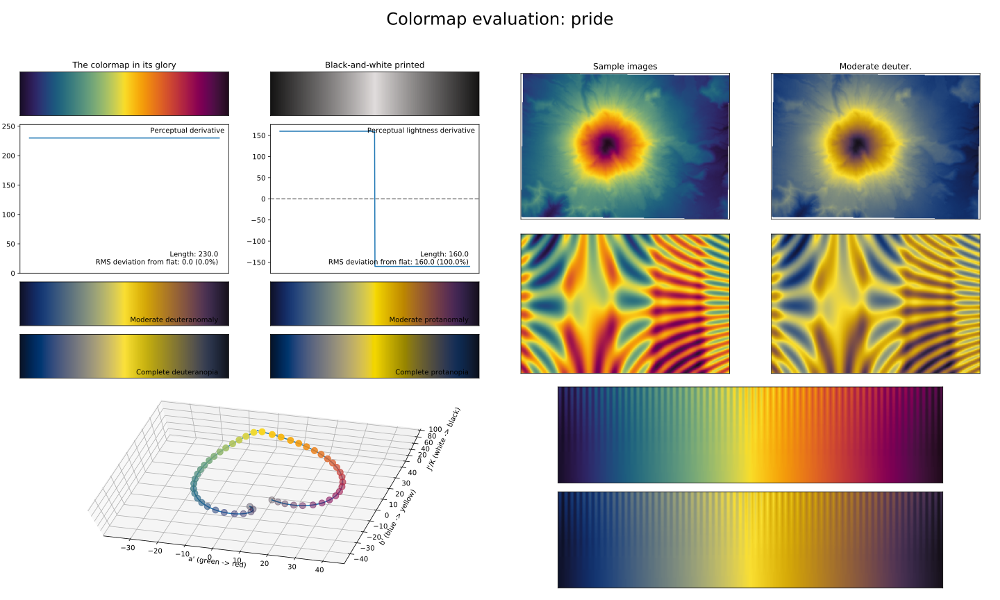
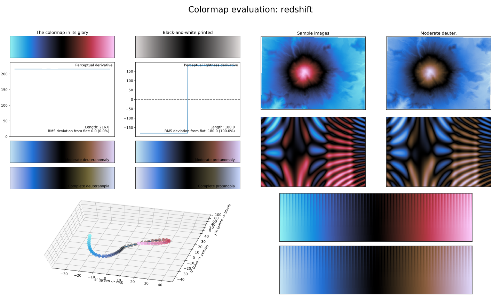
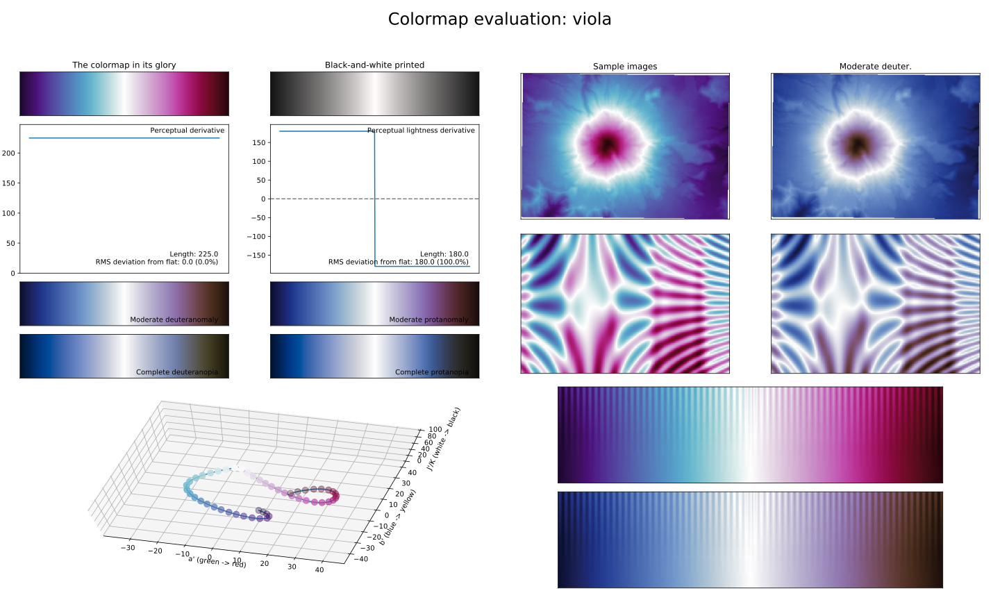
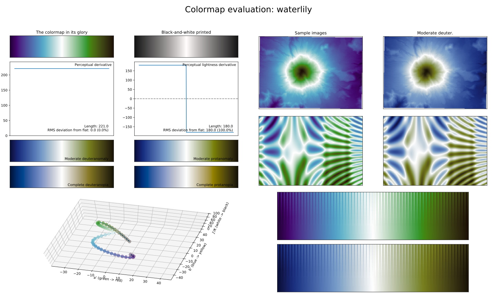

.. _diverging:

Diverging colormaps
===================
A different category or class of colormaps, is the group of *diverging* colormaps.
Unlike sequential colormaps, diverging colormaps start at their lowest (or highest) lightness value at both ends and monotonically/linearly increase (decrease) to the highest (lowest) lightness value in the center.
They could be seen as two sequential colormaps combined together, that share the same lightness range and end/begin with the same color.
This makes them very useful to represent information that has a critical middle value or when data deviates around a common center (usually zero), like topographical maps; radial velocity plots or probability distributions.
The *matplotlib* package has quite a few diverging colormaps, but none of them starts and ends at the same lightness value; and most do not change perceptually uniform.
Therefore, a few alternatives are introduced here, with a full overview being shown below.

    Overview of all diverging colormaps in *CMasher* for Python.

.. _PRISM: https://github.com/1313e/PRISM

.. _fusion:

fusion
------

The *fusion* colormap is a visual representation of two particles fusing together.
It covers almost the full lightness range (:math:`[10, 100]`) and uses the colors blue/purple and orange/red.
It reaches its highest lightness value in the center and is therefore ideal for representing information where the distance to the common center should be highlighted, like in probability distribution maps.

.. _iceburn:

iceburn
-------

The *iceburn* colormap is a visual representation of ice and fire colliding.
It covers almost the full lightness range (:math:`[0, 90]`) and uses the colors blue and orange.
It is special in that, unlike most other diverging colormaps, it reaches its lowest lightness value in the center and increases in lightness towards the ends.
This makes it ideal for representing information where the deviation from the common center should be highlighted or when plotting data values where the sign of a value is used as an indicator, like in a radial velocity or rotation measure map (where the sign is an indicator of direction).

.. _pride:

pride
-------

The *pride* colormap is a visual representation of the equality of all communities.
It covers the special lightness range of :math:`[10, 90]` and uses all major colors.
Like the :ref:`fusion` colormap, this colormap has an exceptionally high perceptual range, making it ideal for dense information plots where the distance to the common center should be highlighted.
Note that unlike most other colormaps, *pride* does not feature a black or white area, making it easier to write annotations on top of it.
Also note that, like the :ref:`chroma` sequential colormap, *pride* is not as CVD-friendly as other colormaps in *CMasher*.

.. _redshift:

redshift
--------

The *redshift* colormap is a visual representation of the (mostly) astronomical phenomenon with the same name, where electromagnetic radiation (such as light) undergoes an increase in wavelength.
It covers almost the full lightness range (i.e., :math:`[0, 90]`) and uses red and blue as its main colors.
As with the :ref:`iceburn` colormap, this colormap reaches its lowest lightness value in the center.

.. _viola:

viola
-----

The *viola* colormap is a visual representation of the flower family with the same name.
It covers the :math:`[10, 100]` lightness range and uses the colors blue and pink/purple.
It reaches its highest lightness value in the center, making it great for density maps.

.. _waterlily:

waterlily
---------

The *waterlily* colormap is a visual representation of the water flower with the same name.
Like :ref:`fusion` and :ref:`viola`, it covers the :math:`[10, 100]` lightness range and it uses the colors blue and green.
As with those two colormaps, *waterlily* is great for use in density maps.
