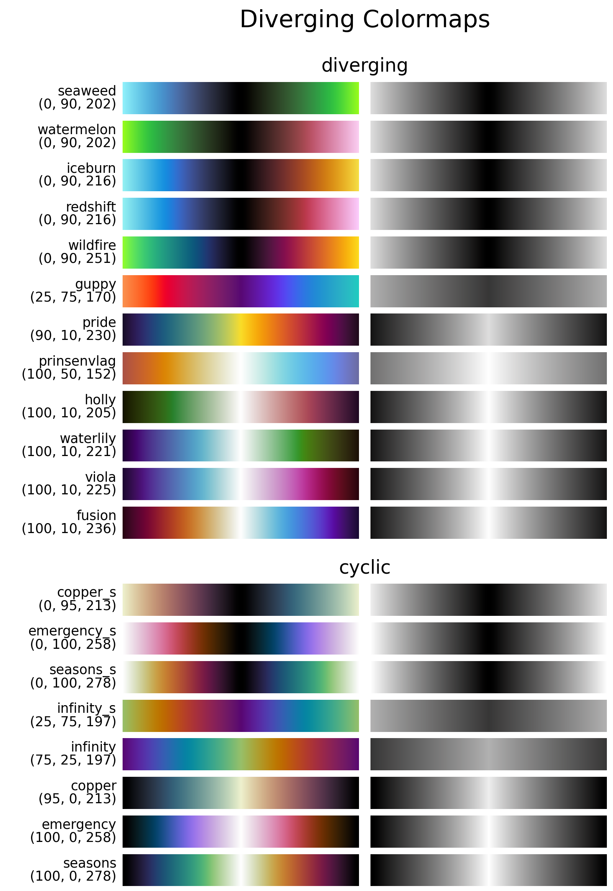

.. _diverging:

Diverging colormaps
===================
A different category or class of colormaps, is the group of *diverging* colormaps.
Unlike sequential colormaps, diverging colormaps start at their lowest (or highest) lightness value at both ends and monotonically/linearly increase (decrease) to the highest (lowest) lightness value in the center.
They could be seen as two sequential colormaps combined together, that share the same lightness range and end/begin with the same color.
This makes them very useful to represent information that has a critical middle value or when data deviates around a common center (usually zero), like topographical maps; radial velocity plots or probability distributions.
The *matplotlib* package has quite a few diverging colormaps, but none of them starts and ends at the same lightness value; and most do not change perceptually uniform.
Therefore, a few alternatives are introduced here, with a full overview being shown below.

    Overview of all diverging colormaps in *CMasher*.

.. _PRISM: https://github.com/1313e/PRISM

.. toctree::
    :caption: Individual colormaps

    diverging/fusion
    diverging/guppy
    diverging/iceburn
    diverging/pride
    diverging/redshift
    diverging/seasons
    diverging/viola
    diverging/waterlily
    diverging/watermelon
    diverging/wildfire