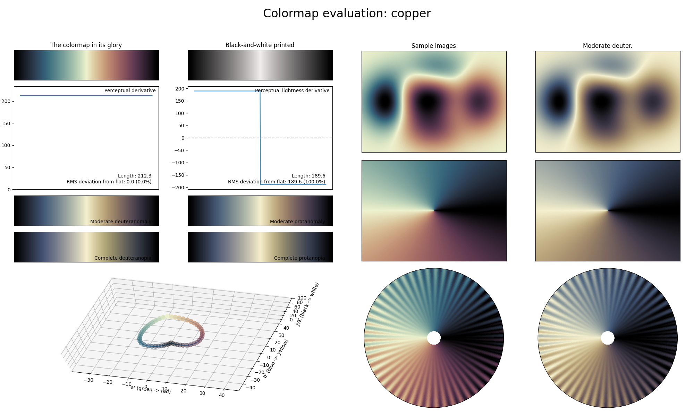

.. _copper:

copper
------

The *copper* colormap is a visual representation of both oxidized copper (left, like copper ore) and refined copper (right, like copper ingots).
It is a cyclic colormap that covers the :math:`[0, 95]` lightness range, and uses basically all colors.
This colormap is similar to the :ref:`seasons` cyclic colormap, but uses less bright colors, making it more appropriate to use in plots that have lots of information/elements.
Also, like :ref:`seasons`, *copper* is not CVD-friendly.
