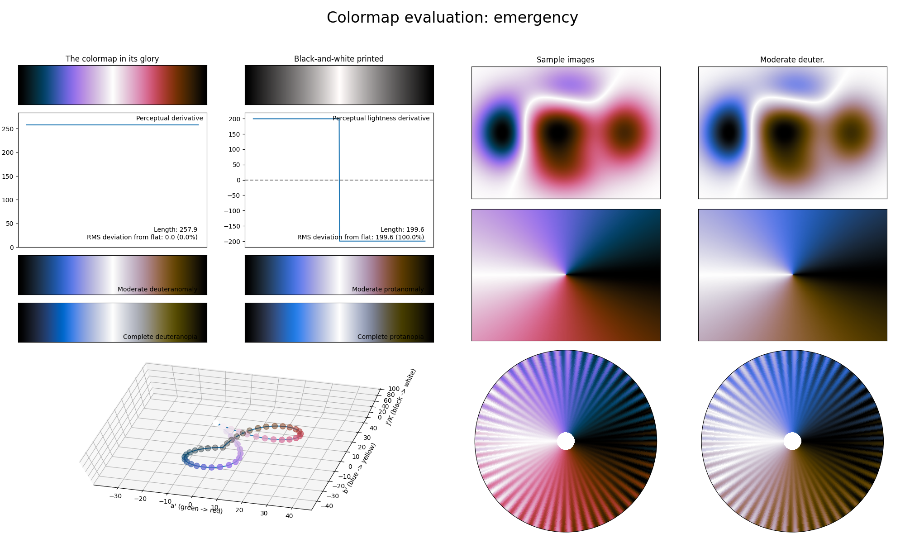

.. _emergency:

emergency
---------

The *emergency* colormap is a visual representation of the emergency warning lights on emergency vehicles in many countries.
Unlike many other diverging colormaps, *emergency* is a cyclic colormap, covering the full lightness range and using the colors red and blue.
Because *emergency* is a cyclic colormap that is CVD-friendly, it is the main colormap to use for plots with cyclic or periodic information.
