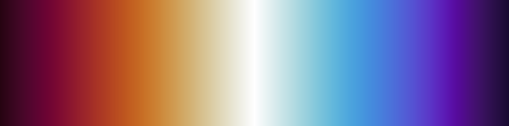
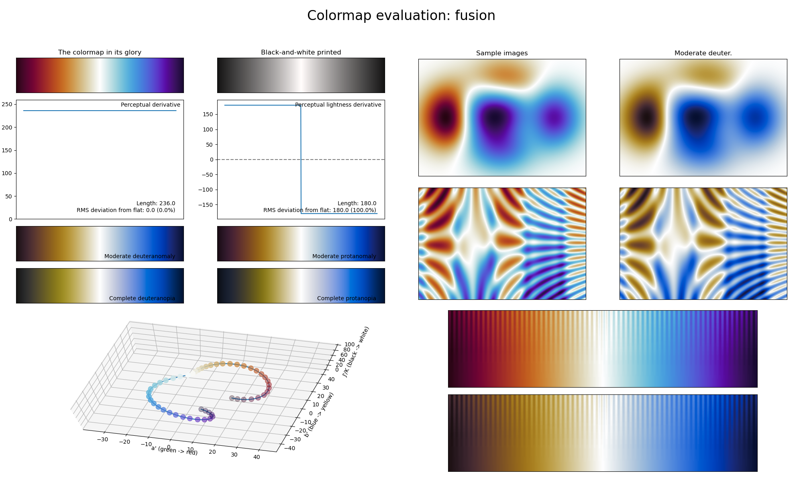

.. _fusion:

fusion
------

The *fusion* colormap is a visual representation of two particles fusing together.
It covers almost the full lightness range (:math:`[10, 100]`) and uses the colors blue/purple and orange/red.
It reaches its highest lightness value in the center and is therefore ideal for representing information where the distance to the common center should be highlighted, like in probability distribution maps.
