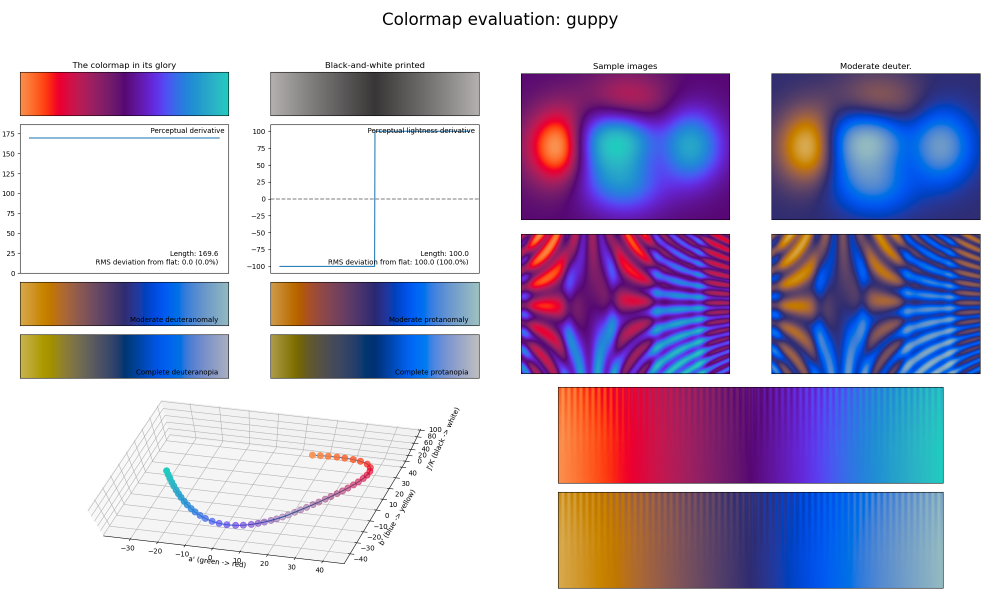

.. _guppy:

guppy
-----
.. image:: ../../../../src/cmasher/colormaps/guppy/guppy.png
    :alt: Visual representation of the *guppy* colormap.
    :width: 100%
    :align: center

The *guppy* colormap is a visual representation of the tropical fish species with the same name.
It covers the special :math:`[25, 75]` lightness range and uses the colors red and blue.
Its unique lightness range and relatively high perceptual range, makes it great for representing dense information that must be annotated or plotted over.
