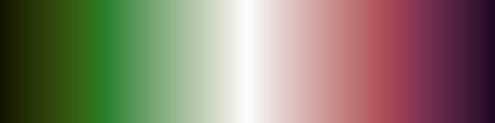
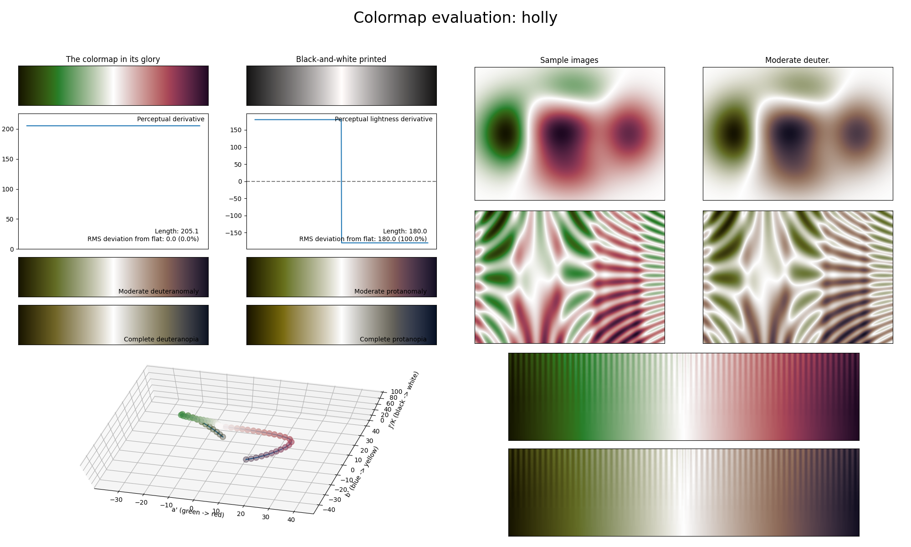

.. _holly:

holly
-----

The *holly* colormap is a visual representation of the flower/plant with the same name, commonly associated with Christmas.
It covers the :math:`[10, 100]` lightness range and uses the colors red and green.
Like the :ref:`watermelon` diverging colormap, *holly* does not use any blue and therefore is not CVD-friendly.
