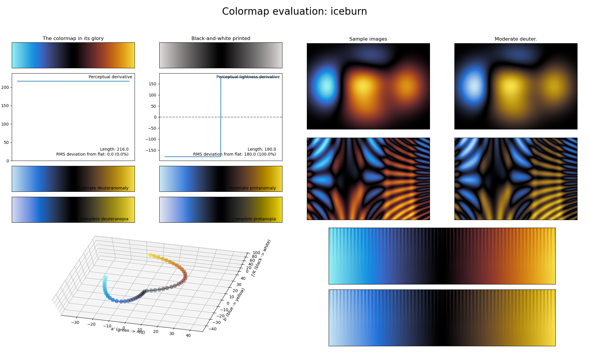

.. _iceburn:

iceburn
-------

The *iceburn* colormap is a visual representation of ice and fire colliding.
It covers almost the full lightness range (:math:`[0, 90]`) and uses the colors blue and orange.
It is special in that, unlike most other diverging colormaps, it reaches its lowest lightness value in the center and increases in lightness towards the ends.
This makes it ideal for representing information where the deviation from the common center should be highlighted or when plotting data values where the sign of a value is used as an indicator, like in a radial velocity or rotation measure map (where the sign is an indicator of direction).
