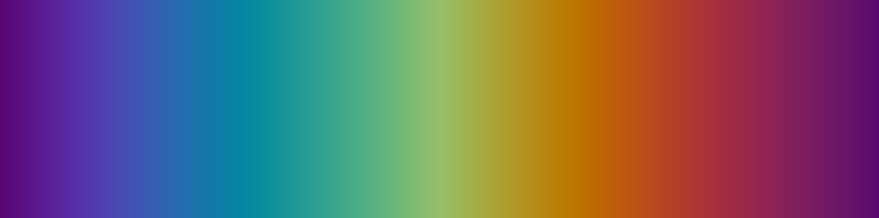
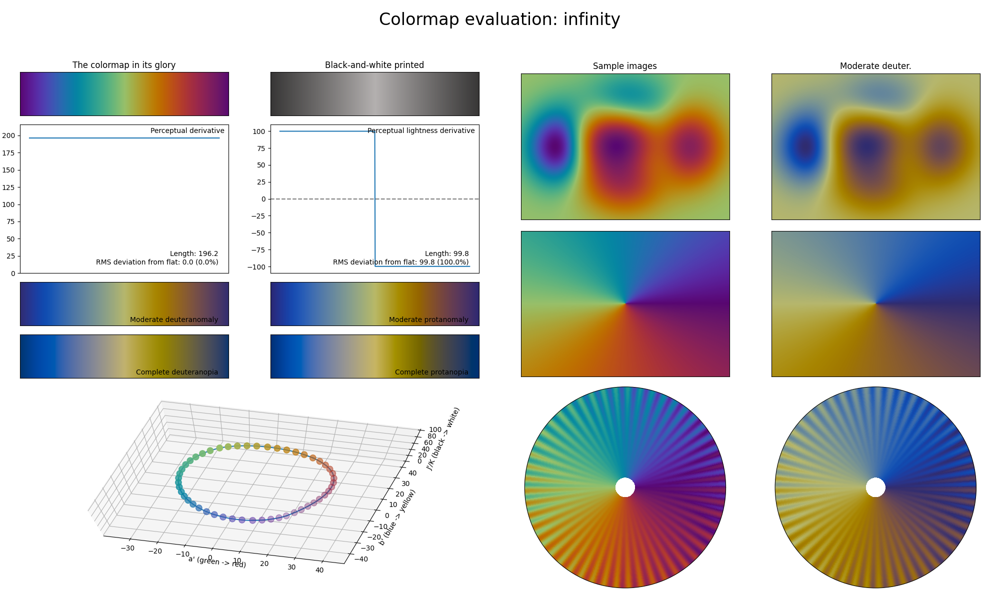

.. _infinity:

infinity
--------

The *infinity* colormap is a visual representation of the infiniteness of a circle and the `Ouroboros <https://en.wikipedia.org/wiki/Ouroboros>`_ symbol.
It covers the special :math:`[25, 75]` lightness range and uses basically all colors in roughly equal ratio.
Unlike other diverging colormaps, *infinity* is a cyclic colormap.
Due to *infinity* using all colors, this colormap is great for use in very dense cyclic information plots.
It can also be used as an alternative to :ref:`pride` as a diverging colormap by removing a small part at the beginning and end.
