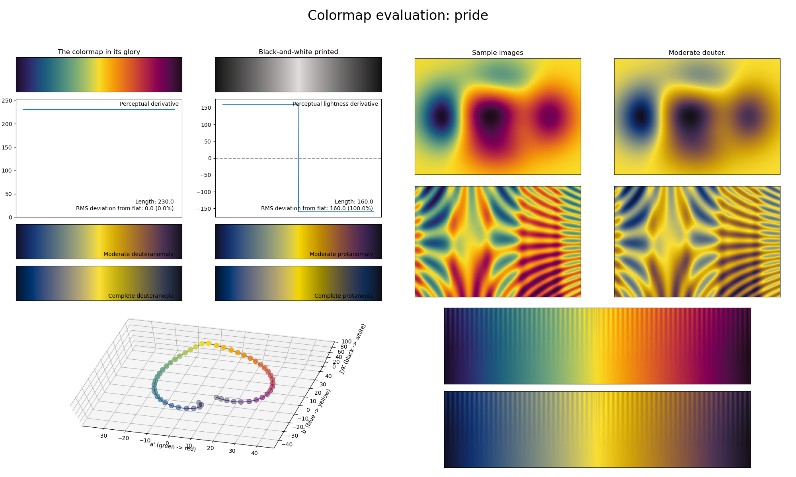

.. _pride:

pride
-----

The *pride* colormap is a visual representation of the equality of all communities.
It covers the special lightness range of :math:`[10, 90]` and uses all major colors.
Like the :ref:`fusion` and :ref:`seasons` colormaps, this colormap has an exceptionally high perceptual range, making it ideal for dense information plots where the distance to the common center should be highlighted.
Note that unlike most other colormaps, *pride* does not feature a black or white area, making it easier to write annotations on top of it.
Also note that, like the :ref:`chroma` sequential colormap, *pride* is not as CVD-friendly as other colormaps in *CMasher*.
