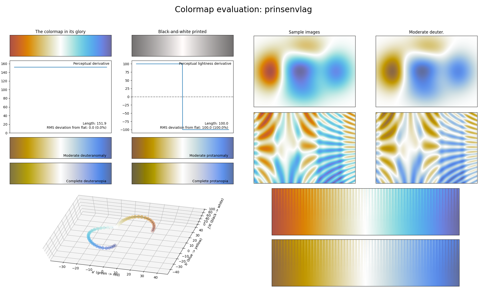

.. _prinsenvlag:

prinsenvlag
-----------

The *prinsenvlag* colormap is a visual representation of the flag with the same name, which one can read about right `here <https://en.wikipedia.org/wiki/Prince%27s_Flag>`_.
It covers the special :math:`[50, 100]` lightness range and uses the colors orange and blue.
Because the entire colormap is fairly bright, *prinsenvlag* is great for usage in plots where all values are important and should be distinguishable.
