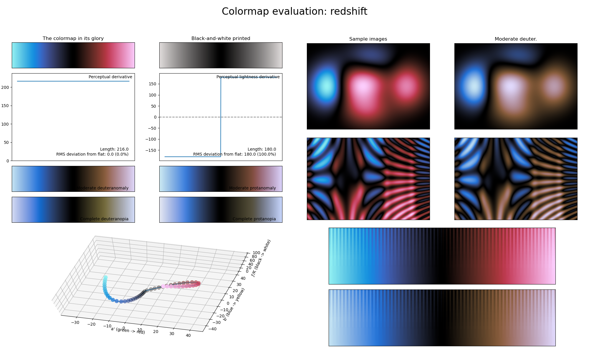

.. _redshift:

redshift
--------

The *redshift* colormap is a visual representation of the (mostly) astronomical phenomenon with the same name, where electromagnetic radiation (such as light) undergoes an increase in wavelength.
It covers almost the full lightness range (i.e., :math:`[0, 90]`) and uses red and blue as its main colors.
As with the :ref:`iceburn` colormap, this colormap reaches its lowest lightness value in the center.
