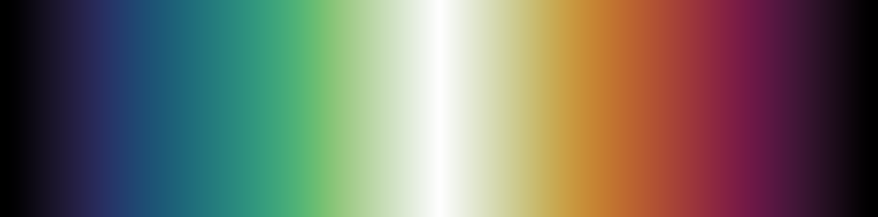
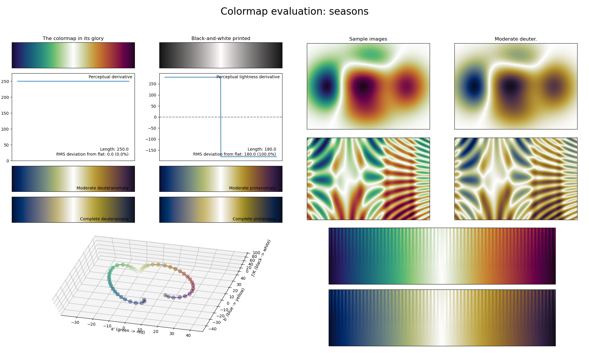

.. _seasons:

seasons
-------

The *seasons* colormap is a visual representation of the spring, summer and fall seasons.
Like a few other diverging colormaps, it covers the :math:`[10, 100]` lightness range and it uses basically all colors.
Due to its exceptionally high perceptual range, *seasons* is great for use in plots with very dense information.
Note that, like :ref:`pride`, this colormap is not as CVD-friendly as other diverging colormaps.
A good alternative that is CVD-friendly is :ref:`fusion`.