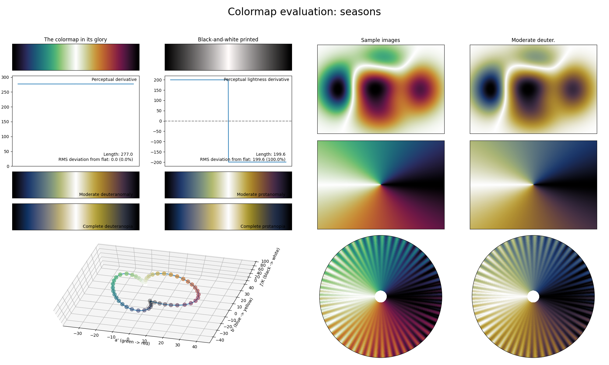

.. _seasons:

seasons
-------
.. image:: ../../../../src/cmasher/colormaps/seasons/seasons.png
    :alt: Visual representation of the *seasons* colormap.
    :width: 100%
    :align: center

The *seasons* colormap is a visual representation of the cycle of the four seasons; winter, spring, summer and fall.
Like :ref:`emergency` and :ref:`infinity`, *seasons* is a cyclic colormap, covering the full lightness range and using basically all colors.
Due to its exceptionally high perceptual range, *seasons* is great for use in plots with very dense information.
Note that this colormap is not as CVD-friendly as other diverging or cyclic colormaps.
A good cyclic alternative that is CVD-friendly is :ref:`emergency`.

.. note::

    The *seasons* colormap used to be a diverging colormap prior to v1.6.0.
    If one wishes to use the previous diverging version of *seasons*, one can easily obtain this colormap using the :func:`~cmasher.get_sub_cmap` function as :pycode:`cmr.get_sub_cmap('cmr.seasons', 0.05, 0.95)`.
