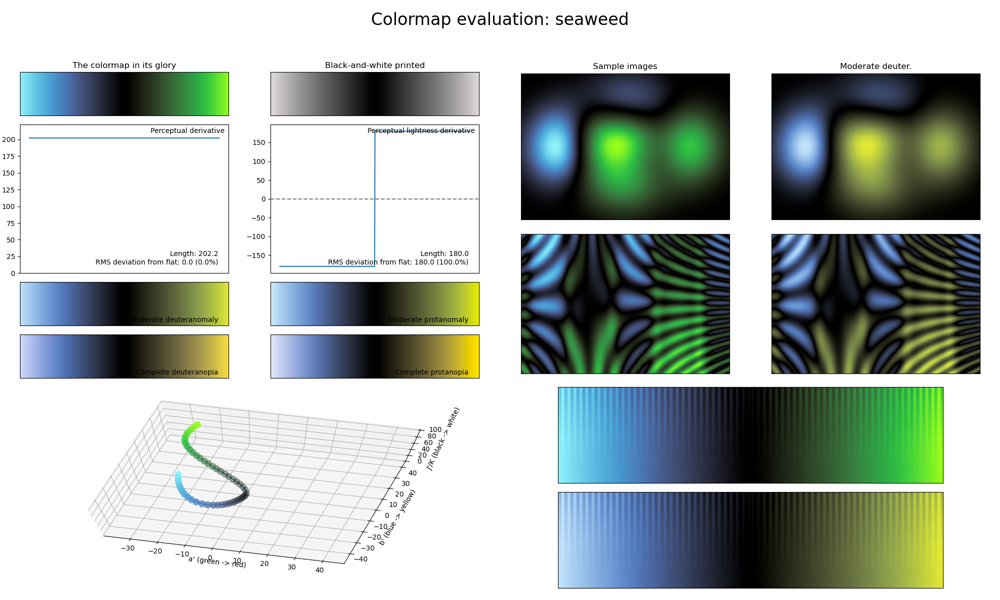

.. _seaweed:

seaweed
-------

The *seaweed* colormap is a visual representation of the type of sea algae with the same name.
It covers the :math:`[0, 90]` lightness range and uses the colors blue and green.
As with the :ref:`iceburn` and :ref:`redshift` colormaps, *watermelon* reaches its lowest lightness value in the center, making it great for representing information where the distance towards the common center should be highlighted.
