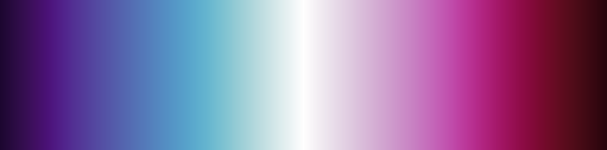
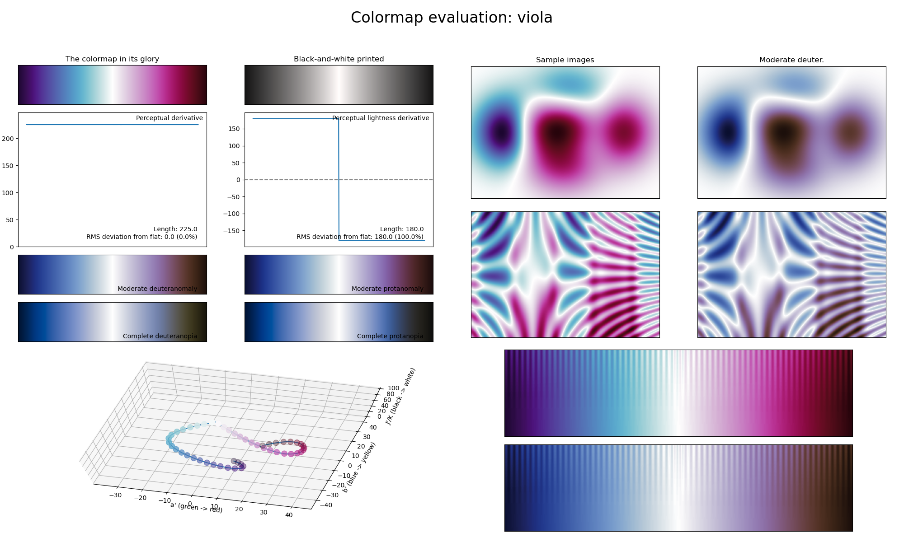

.. _viola:

viola
-----

The *viola* colormap is a visual representation of the flower family with the same name.
It covers the :math:`[10, 100]` lightness range and uses the colors blue and pink/purple.
It reaches its highest lightness value in the center, making it great for density maps.
