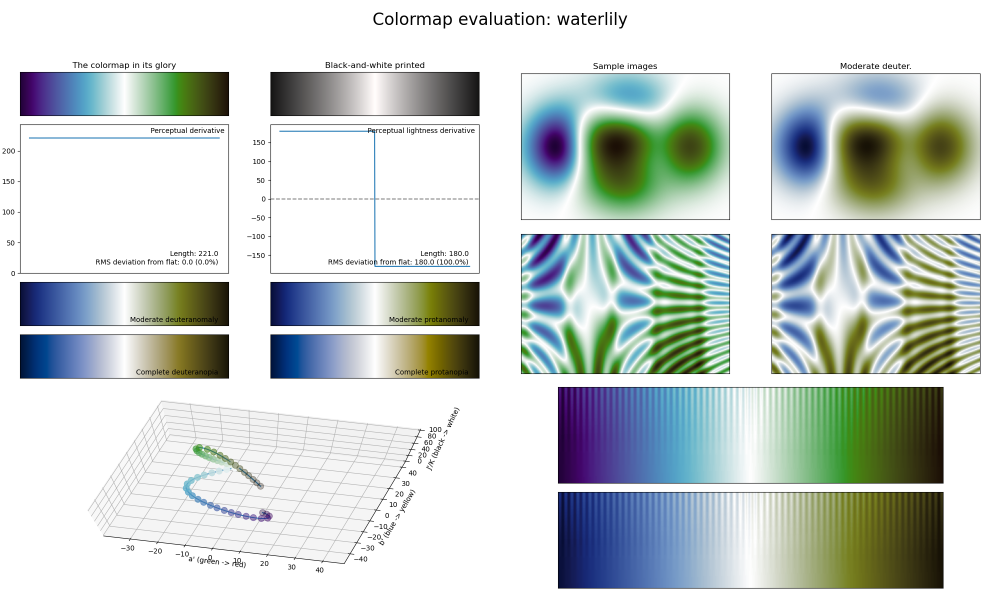

.. _waterlily:

waterlily
---------

The *waterlily* colormap is a visual representation of the water flower with the same name.
Like :ref:`fusion` and :ref:`viola`, it covers the :math:`[10, 100]` lightness range and it uses the colors blue and green.
As with those two colormaps, *waterlily* is great for use in density maps.
