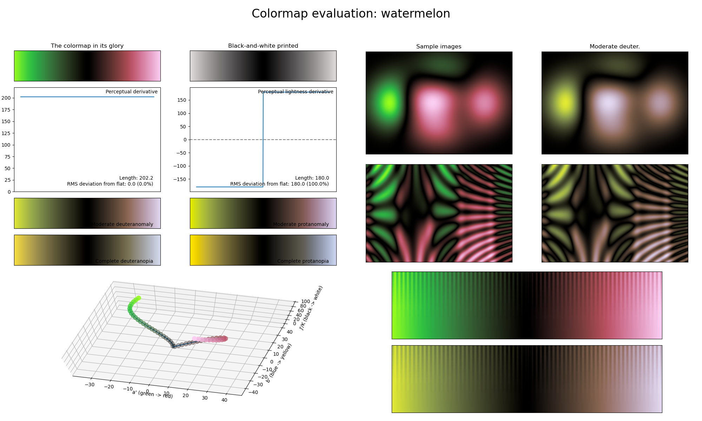

.. _watermelon:

watermelon
----------

The *watermelon* colormap is a visual representation of the fruit with the same name.
It covers the :math:`[0, 90]` lightness range and uses the colors green and red/pink.
As with the :ref:`iceburn`; :ref:`redshift` and :ref:`seaweed` colormaps, *watermelon* reaches its lowest lightness value in the center.
Keep in mind however that, due to the colors used in *watermelon*, this colormap is absolutely not CVD-friendly.
