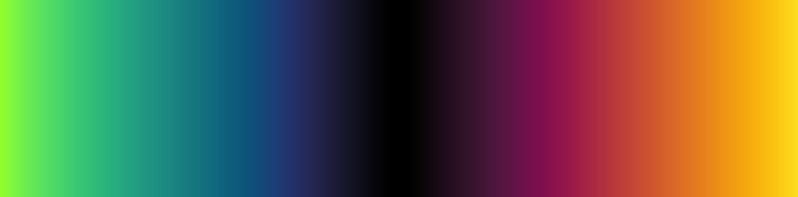
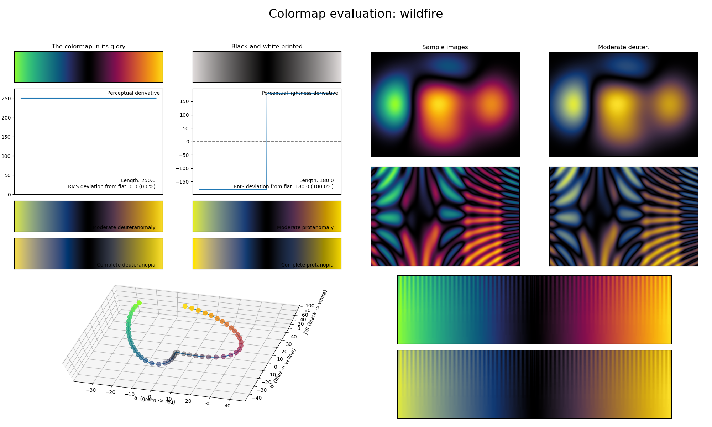

.. _wildfire:

wildfire
--------

The *wildfire* colormap is a visual representation of the natural disaster with the same name.
Like a few other diverging colormaps, it covers the special :math:`[0, 90]` lightness range and it uses basically all colors.
Due to its exceptionally high perceptual range, *wildfire* is great for use in plots with very dense information.
Note that, like :ref:`pride` and :ref:`seasons`, this colormap is not as CVD-friendly as other diverging colormaps.
A good alternative that is CVD-friendly is :ref:`iceburn`.
