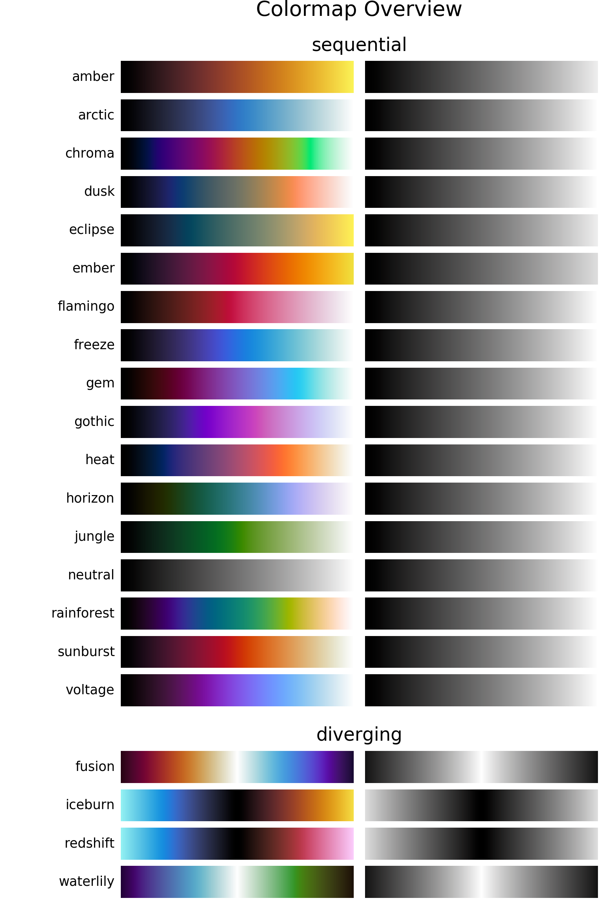

.. _introduction:

Introduction
============
Description
-----------
The *CMasher* package provides a collection of scientific colormaps to be used by different *Python* packages and projects, mainly in combination with `matplotlib`_ (see `here <https://matplotlib.org/3.1.0/tutorials/colors/colormaps.html>`_ for an overview of all their colormaps as of v3.1.0).
The colormaps in *CMasher* are all designed to be perceptually uniform sequential, most of them are color-vision deficiency (CVD; color blindness) friendly and they cover a wide range of different color combinations to accommodate for most applications.
It offers several alternatives to commonly used colormaps, like *chroma* and *rainforest* for *jet*; *sunburst* for *hot*; *neutral* for *binary*; and *fusion* and *redshift* for *coolwarm*.
All colormaps presented here were made using the `viscm`_ package.
If you cannot find your ideal colormap, then please open an `issue`_, provide the colors and/or style you want, and I will try to create one to your liking!

*If you use CMasher for your work, then please star the repo, such that I can keep track of how many users it has and more easily raise awareness of bad colormaps.*

Colormap overview
-----------------
Below is an overview of all the colormaps that are currently in *CMasher*.

How to install
--------------
*CMasher* can be easily installed by either cloning the `repository`_ and installing it manually::

    $ git clone https://github.com/1313e/CMasher
    $ cd CMasher
    $ pip install .

or by installing it directly from `PyPI`_ with::

    $ pip install cmasher

*CMasher* can now be imported as a package with :pycode:`import cmasher as cmr`.

Example use
-----------
The colormaps shown above can be accessed by simply importing *CMasher* (which automatically executes the :func:`~cmasher.utils.import_cmaps` function on the `cmasher/colormaps`_ directory).
This makes them available in *CMasher*'s :mod:`~cmasher.cm` module, in addition to registering them in *matplotlib*'s :mod:`~matplotlib.cm` module (with added :pycode:`'cmr.'` prefix to avoid name clashes).
So, for example, if one were to use the *rainforest* colormap, this could be done with::

    # Import CMasher to register colormaps
    import cmasher as cmr

    # Import packages for plotting
    import matplotlib.pyplot as plt
    import numpy as np

    # Access rainforest colormap through CMasher
    cmap = cmr.rainforest

    # Access rainforest colormap through MPL
    # CMasher colormaps in MPL have an added 'cmr.' prefix
    cmap = 'cmr.rainforest'

    # Generate some data to plot
    x = np.random.rand(100)
    y = np.random.rand(100)
    z = x**2+y**2

    # Make scatter plot of data with colormap
    plt.scatter(x, y, c=z, cmap=cmap, s=300)
    plt.show()

Accessing the colormaps in other packages than *matplotlib* would require reading in the text-files in the `cmasher/colormaps`_ directory, which contain the normalized RGB values (multiply by :math:`255` for regular 8-bit values) of every colormap, and registering them in the package manually.
For those that are interested, the *viscm* source files that were used for creating the colormaps can also be found in the `cmasher/colormaps`_ directory in the repo (the source files are not provided with the package distribution).

.. _viscm: https://github.com/matplotlib/viscm
.. _repository: https://github.com/1313e/CMasher
.. _PyPI: https://pypi.org/project/CMasher
.. _matplotlib: https://github.com/matplotlib/matplotlib
.. _issue: https://github.com/1313e/CMasher/issues
.. _cmasher/colormaps: https://github.com/1313e/CMasher/tree/master/cmasher/colormaps
