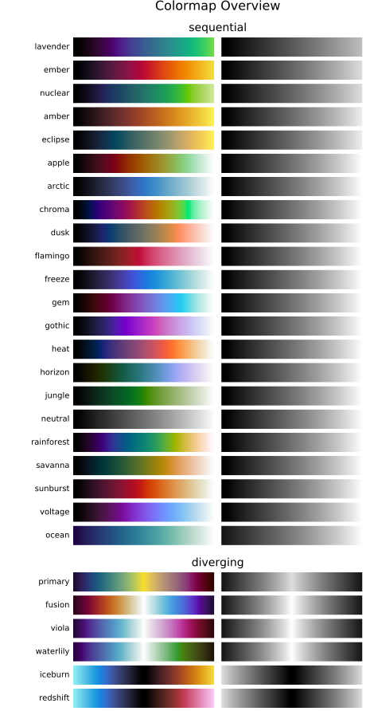

.. _introduction:

Introduction
============
Description
-----------
The *CMasher* package provides a collection of scientific colormaps to be used by different *Python* packages and projects, mainly in combination with `matplotlib`_ (see `here <https://matplotlib.org/3.1.0/tutorials/colors/colormaps.html>`_ for an overview of all their colormaps as of v3.1.0).
The colormaps in *CMasher* are all designed to be perceptually uniform sequential using the `viscm`_ package; most of them are color-vision deficiency (CVD; color blindness) friendly; and they cover a wide range of different color combinations to accommodate for most applications.
It offers several alternatives to commonly used colormaps, like :ref:`chroma` and :ref:`rainforest` for *jet*; :ref:`sunburst` for *hot*; :ref:`neutral` for *binary*; and :ref:`fusion` and :ref:`redshift` for *coolwarm*.
If you cannot find your ideal colormap, then please open an `issue`_, provide the colors and/or style you want, and I will try to create one to your liking!

*If you use CMasher for your work, then please star the repo, such that I can keep track of how many users it has and more easily raise awareness of bad colormaps.*

Colormap overview
-----------------
Below is an overview of all the colormaps that are currently in *CMasher* (made with the :func:`~cmasher.create_cmap_overview` function).

    Overview of all colormaps in *CMasher* for Python.

How to install
--------------
*CMasher* can be easily installed by either cloning the `repository`_ and installing it manually::

    $ git clone https://github.com/1313e/CMasher
    $ cd CMasher
    $ pip install .

or by installing it directly from `PyPI`_ with::

    $ pip install cmasher

*CMasher* can now be imported as a package with :pycode:`import cmasher as cmr`.

Example use
-----------
The colormaps shown above can be accessed by simply importing *CMasher*.
This makes them available in the :mod:`~cmasher` module, in addition to registering them in *matplotlib*'s :mod:`~matplotlib.cm` module (with added ``'cmr.'`` prefix to avoid name clashes).
So, for example, if one were to use the :ref:`rainforest` colormap, this could be done with::

    # Import CMasher to register colormaps
    import cmasher as cmr

    # Import packages for plotting
    import matplotlib.pyplot as plt
    import numpy as np

    # Access rainforest colormap through CMasher or MPL
    cmap = cmr.rainforest                   # CMasher
    cmap = plt.get_cmap('cmr.rainforest')   # MPL

    # Generate some data to plot
    x = np.random.rand(100)
    y = np.random.rand(100)
    z = x**2+y**2

    # Make scatter plot of data with colormap
    plt.scatter(x, y, c=z, cmap=cmap, s=300)
    plt.show()

Accessing the colormaps in other packages than *matplotlib* would require reading in the text files in the `cmasher/colormaps`_ directory, which contain the normalized RGB values (multiply by :math:`255` for regular 8-bit values) of every colormap, and registering them in the package manually.
For those that are interested, the *viscm* source files that were used for creating the colormaps can also be found in the `cmasher/colormaps`_ directory in the repo (the source files are not provided with the package distribution).
Note that my modified version of *viscm* (available `here <https://github.com/1313e/viscm>`_) is required in order to properly view and edit the source file of a diverging colormap.

Using custom colormaps
----------------------
*CMasher* allows for custom colormaps to be imported with the :func:`~cmasher.import_cmaps` function (which is executed automatically on the `cmasher/colormaps`_ directory when *CMasher* is imported).
This function takes the path to a colormap file named ``cm_<cmap_name>`` (or the path to a directory containing such files); creates a :obj:`~matplotlib.colors.ListedColormap` object using the data in the file; and registers it in *matplotlib* with the name ``'cmr.<cmap_name>'`` (it will also be available in *CMasher* as :pycode:`cmr.cm.<cmap_name>`).
A colormap file can either be a JSCM-file as created by *viscm* or a text file that contains the normalized RGB values of the colormap (see the text files in the `cmasher/colormaps`_ directory for the structure of such files).

Note that colormaps imported this way cannot be accessed through *CMasher* using :pycode:`cmr.<cmap_name>`, unlike *CMasher*'s own colormaps, but solely using :pycode:`cmr.cm.<cmap_name>` (access through *matplotlib* is unchanged).
This is to keep official and unofficial colormaps separated in *CMasher*.

.. _viscm: https://github.com/matplotlib/viscm
.. _repository: https://github.com/1313e/CMasher
.. _PyPI: https://pypi.org/project/CMasher
.. _matplotlib: https://github.com/matplotlib/matplotlib
.. _issue: https://github.com/1313e/CMasher/issues
.. _cmasher/colormaps: https://github.com/1313e/CMasher/tree/master/cmasher/colormaps
