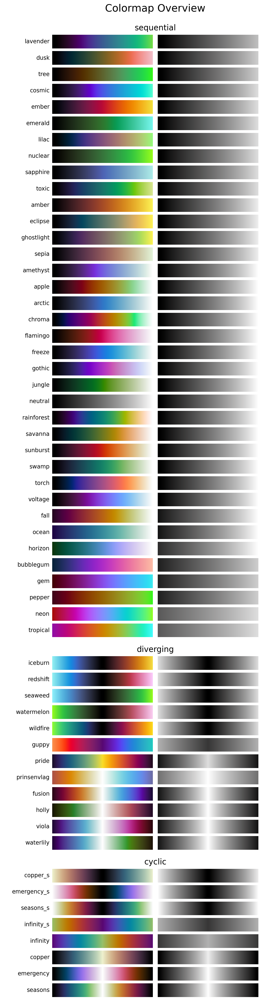

.. _introduction:

Introduction
============
Description
-----------
The *CMasher* package provides a collection of scientific colormaps and utility functions to be used by different *Python* packages and projects, mainly in combination with `matplotlib`_ (see `here <https://matplotlib.org/3.1.0/tutorials/colors/colormaps.html>`_ for an overview of all their colormaps as of v3.1.0).
The colormaps in *CMasher* are all designed to be perceptually uniform sequential using the `viscm`_ package; most of them are color-vision deficiency (CVD; color blindness) friendly; and they cover a wide range of different color combinations to accommodate for most applications.
It offers several alternatives to commonly used colormaps, like :ref:`chroma` and :ref:`rainforest` for *jet*; :ref:`sunburst` for *hot*; :ref:`neutral` for *binary*; and :ref:`fusion` and :ref:`redshift` for *coolwarm*.
If you cannot find your ideal colormap, then please open an `issue`_, provide the colors and/or style you want, and I will try to create one to your liking!

*If you use CMasher for your work, then please star the repo, such that I can keep track of how many users it has and more easily raise awareness of bad colormaps.*
*Additionally, if you use CMasher as part of your workflow in a scientific publication, please consider citing the CMasher paper* (*BibTeX:* :func:`~cmasher.get_bibtex`).

Colormap overview
-----------------
Below is an overview of all the colormaps that are currently in *CMasher* (made with the :func:`~cmasher.create_cmap_overview` function).

    Overview of all colormaps in *CMasher*.

How to install
--------------
*CMasher* can be easily installed directly from `PyPI`_ with::

    $ pip install cmasher

or `conda-forge`_ with::

    $ conda install -c conda-forge cmasher  # If conda-forge is not set up as a channel
    $ conda install cmasher                 # If conda-forge is set up as a channel

If required, one can also clone the `repository`_ and install *CMasher* manually::

    $ git clone https://github.com/1313e/CMasher
    $ cd CMasher
    $ pip install .

*CMasher* can now be imported as a package with :pycode:`import cmasher as cmr`.

Example use
-----------
The colormaps shown above can be accessed by simply importing *CMasher*.
This makes them available in the :mod:`~cmasher` module, in addition to registering them in *matplotlib*'s :mod:`~matplotlib.cm` module (with added ``'cmr.'`` prefix to avoid name clashes).
So, for example, if one were to use the :ref:`rainforest` colormap, this could be done with::

    # Import CMasher to register colormaps
    import cmasher as cmr

    # Import packages for plotting
    import matplotlib.pyplot as plt
    import numpy as np

    # Access rainforest colormap through CMasher or MPL
    cmap = cmr.rainforest                   # CMasher
    cmap = plt.get_cmap('cmr.rainforest')   # MPL

    # Generate some data to plot
    x = np.random.rand(100)
    y = np.random.rand(100)
    z = x**2+y**2

    # Make scatter plot of data with colormap
    plt.scatter(x, y, c=z, cmap=cmap, s=300)
    plt.show()

See :ref:`usage` for more use-cases.

.. _viscm: https://github.com/matplotlib/viscm
.. _repository: https://github.com/1313e/CMasher
.. _PyPI: https://pypi.org/project/CMasher
.. _conda-forge: https://anaconda.org/conda-forge/CMasher
.. _matplotlib: https://github.com/matplotlib/matplotlib
.. _issue: https://github.com/1313e/CMasher/issues
.. _cmasher/colormaps: https://github.com/1313e/CMasher/tree/master/cmasher/colormaps
