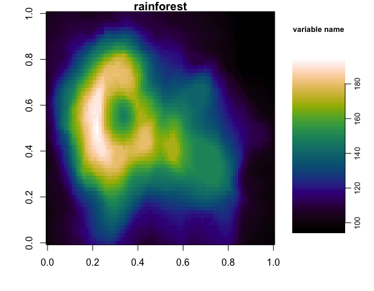

R
=
The following example shows how to import and use the *CMasher* colormaps in R.
If you use *CMasher* for your work in R, then please star the `repo`_, and if you use *CMasher* in a scientific publication, please consider citing the *CMasher* paper using the BibTeX-entry found in the :ref:`community_guidelines`.

Big thanks to `@calofost`_ for writing `this short tutorial <https://github.com/1313e/CMasher/issues/26#issuecomment-716868786>`_.

.. _@calofost: https://github.com/calofost
.. _repo: https://github.com/1313e/CMasher

----

First of all, we will need to clone the *CMasher* repository with::

    $ git clone https://github.com/1313e/CMasher

If one already has cloned the repository, make sure that it is also up-to-date::

    $ cd CMasher
    $ git pull

We assume here that the *CMasher* repository is located in the current directory.
Modify the paths in the following R scripts appropriately if this is not the case.

In order to use the *CMasher* colormaps in R, we will use the *RColorBrewer* package to load in the RGB values.
Installing *RColorBrewer* is very simple:

.. code:: R

    # If RColorBrewer is not already installed, install it with:
    install.packages('RColorBrewer')

With *RColorBrewer*, we will create an RDS object that may be loaded into any R project after creation.
This RDS object only needs to be created once (and every time new colormaps have been added to *CMasher*).
Make sure to modify the path to the location where you want to store the RDS object for future use in the following R scripts.

.. code:: R

    # Loading RColorBrewer package.
    library(RColorBrewer)

    # Edit following paths:
    colormaps_path = './CMasher/cmasher/colormaps'
    RDSfilepath = '/path/to/where/you/wanna/keep/the/RDS/object'

    # Looking up the names of the scales and location of the _norm.txt files:
    cmr_cmaps_files = list.files(path=colormaps_path, recursive=TRUE, all.files=TRUE,
                                 full.name=TRUE, pattern='_norm.txt')
    cmr_cmaps_list = list.dirs(path=colormaps_path, full.names=FALSE)
    cmr_cmaps_list = cmr_cmaps_list[2:length(cmr_cmaps_list)] # Removing "." from the list of directories

    # Loading all colour scales and adding them to a list object containing all scales called cmr_cmaps.
    cmr_cmaps = list()
    for (cmr_cmap in cmr_cmaps_list) {
      CM_RGB = read.table(file=cmr_cmaps_files[grep(pattern=cmr_cmap, cmr_cmaps_list)])
      colnames(CM_RGB) = c('R', 'G', 'B')
      assign(cmr_cmap, rgb(red=CM_RGB$R, green=CM_RGB$G, blue=CM_RGB$B))
      cmr_cmaps[[cmr_cmap]] = get(cmr_cmap)
    }

    # Create RDS file containing all CMasher colormaps into a single object:
    saveRDS(cmr_cmaps, file=paste0(RDSfilepath, '/', 'cmr_cmaps.RDS'))

Now that we have created an RDS object, we can easily reload the *CMasher* colormaps with the following R script:

.. code:: R

    # Easy to load using the RDS object back into any R project using:
    RDSfilepath = '/path/to/where/you/wanna/keep/the/RDS/object'
    cmr_cmaps = readRDS(file=paste0(RDSfilepath, '/', 'cmr_cmaps.RDS'))

And there you go, the colormaps are now all contained within the ``cmr_cmaps`` R object list.
To access a specific colormap, we can simply use the ``$`` operator (e.g., the :ref:`rainforest` colormap can be accessed as ``cmr_cmaps$rainforest``).

Below, we show an example of using the :ref:`rainforest` colormap to create a test plot (after loading in the RDS object using the script above):

.. code:: R

    # Example use (volcano is an example dataset pre-loaded in every R installation):
    par(mar=c(4, 4, 1, 0.5))
    layout(matrix(c(1, 2), 1, 2, byrow = TRUE), widths=c(3, 1))
    image(volcano, col=cmr_cmaps$rainforest, main="rainforest")
    par(mar=c(5, 1, 5, 2.5))
    image(y=seq(from=min(volcano), to=max(volcano), z=t(1:length(cmr_cmaps$rainforest)),
          by=(diff(range(volcano)))/length(cmr_cmaps$rainforest)),
          col=cmr_cmaps$rainforest, axes=FALSE, main="variable name", cex.main=0.8)
    axis(4, cex.axis=0.8, mgp=c(0, 0.5, 0))

