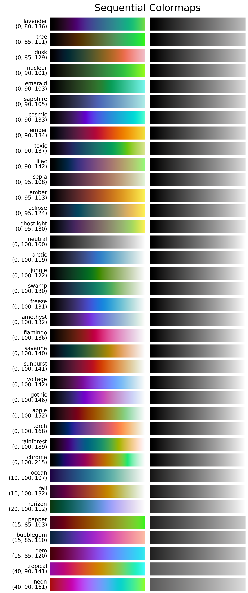

.. _sequential:

Sequential colormaps
====================
Sequential colormaps (that are perceptually uniform of course) are basic colormaps that start at a reasonably low lightness value and uniformly increase to a higher value.
They are commonly used to represent information that is ordered.
The *matplotlib* package already has a few great sequential colormaps readily available for the user, mainly the colormaps named *viridis*; *plasma*; *inferno*; *magma*; and *cividis*.
However, three of these colormaps use the color red as their main color and none of them uses the full lightness range.
As it might sometimes be desirable to use a different main color or maximize the lightness range of the colormap, *CMasher* provides a few sequential colormaps that do exactly that.
These colormaps are shown in an overview and described individually below.

    Overview of all sequential colormaps in *CMasher*, sorted on lightness profile and perceptual range.
    The three numbers below the name of each colormap represent the starting lightness value; the final lightness value; and the perceptual range of that colormap, respectively.

.. _PRISM: https://github.com/1313e/PRISM

.. toctree::
    :caption: Individual colormaps

    sequential/amber
    sequential/amethyst
    sequential/apple
    sequential/arctic
    sequential/bubblegum
    sequential/chroma
    sequential/cosmic
    sequential/dusk
    sequential/eclipse
    sequential/ember
    sequential/emerald
    sequential/fall
    sequential/flamingo
    sequential/freeze
    sequential/gem
    sequential/ghostlight
    sequential/gothic
    sequential/horizon
    sequential/jungle
    sequential/lavender
    sequential/lilac
    sequential/neon
    sequential/neutral
    sequential/nuclear
    sequential/ocean
    sequential/pepper
    sequential/rainforest
    sequential/sapphire
    sequential/savanna
    sequential/sepia
    sequential/sunburst
    sequential/swamp
    sequential/torch
    sequential/toxic
    sequential/tree
    sequential/tropical
    sequential/voltage
