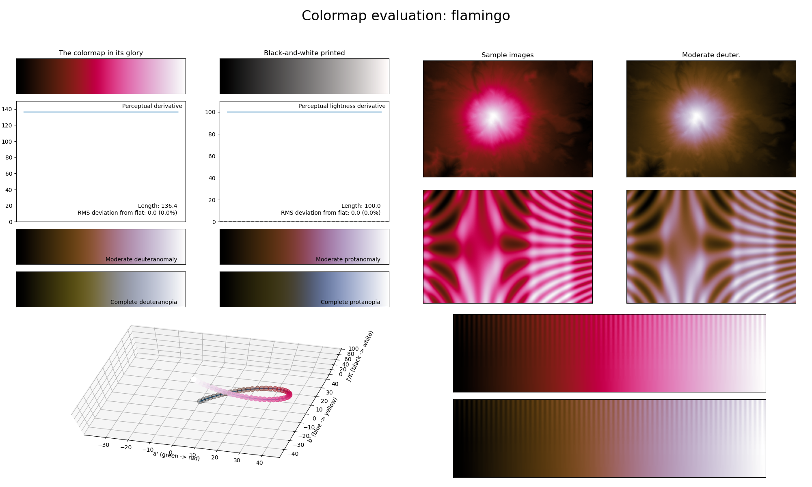
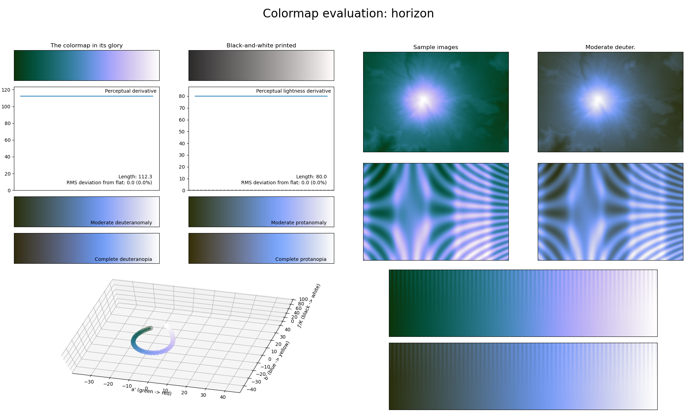
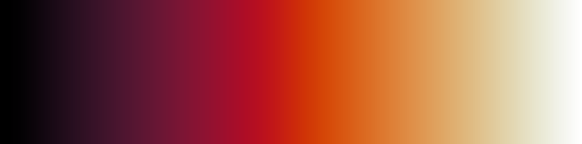

.. _sequential:

Sequential
==========
Sequential colormaps (that are perceptually uniform of course) are basic colormaps that start at a reasonably low lightness value and uniformly increase to a higher value.
They are commonly used to represent information that is ordered.
The *matplotlib* package already has a few great sequential colormaps readily available for the user, mainly the colormaps named *viridis*; *plasma*; *inferno*; *magma*; and *cividis*.
However, three of these colormaps use the color red as their main color and none of them uses the full lightness range.
As it might sometimes be desirable to use a different main color or maximize the lightness range of the colormap, *CMasher* provides a few sequential colormaps that do exactly that.
These colormaps are shown in an overview and described individually below.

    Overview of all sequential colormaps in *CMasher*.

.. _PRISM: https://github.com/1313e/PRISM

Amber
-----
.. figure:: ../../../cmasher/colormaps/amber/amber.png
    :alt: Visual representation of the *amber* colormap.
    :width: 100%
    :align: center
    :name: amber_cmap

The *amber* colormap is a visual representation of the gemstone with the same name.
It covers almost the full lightness range (:math:`[0, 95]`) and uses the color orange/yellow.
Its smoothly varying colors make it great for representing smooth information.

Apple
-----
.. figure:: ../../../cmasher/colormaps/apple/apple.png
    :alt: Visual representation of the *apple* colormap.
    :width: 100%
    :align: center
    :name: apple_cmap

.. figure:: ../../../cmasher/colormaps/apple/apple_viscm.png
    :alt: Statistics of the *apple* colormap.
    :width: 100%
    :align: center
    :name: apple_viscm

The *apple* colormap is a visual representation of the fruit with the same name, in particular an 'Elstar' apple.
It covers the full lightness range and uses the colors red and green.
Its bright colors near the maximum make it great for representing information where higher values should be the main focus.
Despite *apple* using red and green, the colors are far enough apart from each other to still be relatively CVD-friendly.

Arctic
------

The *arctic* colormap is a visual representation of the cold landscape of the Arctic.
It covers the full lightness range and solely uses the color blue.
As the *arctic* colormap uses softer colors, it can be used as an alternative to the *freeze* colormap.

Chroma
------
.. figure:: ../../../cmasher/colormaps/chroma/chroma.png
    :alt: Visual representation of the *chroma* colormap.
    :width: 100%
    :align: center
    :name: chroma_cmap

.. figure:: ../../../cmasher/colormaps/chroma/chroma_viscm.png
    :alt: Statistics of the *chroma* colormap.
    :width: 100%
    :align: center
    :name: chroma_viscm

The *chroma* colormap is a visual representation of all major colors.
It covers the full lightness range and shows all major colors in roughly equal ratio.
Because it uses all major colors, this colormap has a very high perceptual range, making it excellent for representing information where small adjacent differences should be clearly visible.
Keep in mind that the *chroma* colormap is not as CVD-friendly as the other colormaps.

Dusk
----

.. figure:: ../../../cmasher/colormaps/dusk/dusk_viscm.png
    :alt: Statistics of the *dusk* colormap.
    :width: 100%
    :align: center
    :name: dusk_viscm

The *dusk* colormap is a visual representation of what the sky looks like during dusk (with the black/blue representing the dark sky and the red/white the last few sunrays above the horizon).
It covers the full lightness range and has the colors blue and orange as its main colors.
It features a greyish area in the middle, making it great for representing ordered information where the extremes should be the main focus of the image.

Eclipse
-------
.. figure:: ../../../cmasher/colormaps/eclipse/eclipse.png
    :alt: Visual representation of the *eclipse* colormap.
    :width: 100%
    :align: center
    :name: eclipse_cmap

The *eclipse* colormap is a visual representation of a solar eclipse (with the black/blue representing the Moon and the yellow the Sun's corona).
It covers almost the full lightness range (:math:`[0, 95]`) and uses the colors blue and yellow.
It is excellent for representing information where the upper half should be the focus.

Ember
-----

.. figure:: ../../../cmasher/colormaps/ember/ember_viscm.png
    :alt: Statistics of the *ember* colormap.
    :width: 100%
    :align: center
    :name: ember_viscm

The *ember* colormap is a visual representation of coal embers.
It covers almost the full lightness range (:math:`[0, 90]`) and uses the colors red and yellow.
As with some other colormaps in *CMasher*, its smoothly varying colors make it a good choice for representing intensity maps.

Flamingo
--------
.. figure:: ../../../cmasher/colormaps/flamingo/flamingo.png
    :alt: Visual representation of the *flamingo* colormap.
    :width: 100%
    :align: center
    :name: flamingo_cmap

The *flamingo* colormap is a visual representation of the bird with the same name.
It covers the full lightness range and solely uses the color red.
It is the most useful for representing information where the center should be the main focus, but is also great for smoothly varying information.

Freeze
------

.. figure:: ../../../cmasher/colormaps/freeze/freeze_viscm.png
    :alt: Statistics of the *freeze* colormap.
    :width: 100%
    :align: center
    :name: freeze_viscm

The *freeze* colormap is one of the two main colormaps used in `PRISM`_, and is a visual representation of a large body of water freezing over.
It covers the full lightness range and solely uses the color blue.
As it only uses a single color, this colormap is excellent for representing information that varies smoothly, like density/intensity values in a scientific plot.

Gem
---
.. figure:: ../../../cmasher/colormaps/gem/gem.png
    :alt: Visual representation of the *gem* colormap.
    :width: 100%
    :align: center
    :name: gem_cmap

The *gem* colormap is a visual representation of the amethyst and aquamarine gemstones.
It covers the full lightness range and uses the colors purple and blue.
Its very distinctive colors make it useful for representing dense information while not overloading on distractive colors.

Gothic
------

.. figure:: ../../../cmasher/colormaps/gothic/gothic_viscm.png
    :alt: Statistics of the *gothic* colormap.
    :width: 100%
    :align: center
    :name: gothic_viscm

The *gothic* colormap is a visual representation of the stereotypical gothic colors.
It covers the full lightness range and solely uses the color purple.
As with the *freeze* colormap, this colormap is excellent for representing information that varies smoothly.

Heat
----
.. figure:: ../../../cmasher/colormaps/heat/heat.png
    :alt: Visual representation of the *heat* colormap.
    :width: 100%
    :align: center
    :name: heat_cmap

.. figure:: ../../../cmasher/colormaps/heat/heat_viscm.png
    :alt: Statistics of the *heat* colormap.
    :width: 100%
    :align: center
    :name: heat_viscm

The *heat* colormap is a visual representation of the typical blue/orange gas flame.
It covers the full lightness range and mainly uses the colors blue/purple and orange.
It should mainly be used for representing information where the center values are important.

Horizon
-------

The *horizon* colormap is a visual representation of the horizon, from the green colors of the land to the calm colors of the clouds.
It covers the full lightness range and has the colors green and blue as its main colors.
It features a brownish area close to the minimum, making it great for representing ordered information where the minimum is not important.

Jungle
------

The *jungle* colormap is a visual representation of a jungle.
It covers the full lightness range and solely uses the color green.
As with the other single-color colormaps, this colormap is excellent for representing smooth information.

Lavender
--------

The *lavender* colormap is a visual representation of the flower with the same name.
It covers the :math:`[0, 80]` lightness range and uses the colors green and purple.
Its soft and very distinctive coloring makes it great for representing dense information.

Neutral
-------
.. figure:: ../../../cmasher/colormaps/neutral/neutral.png
    :alt: Visual representation of the *neutral* colormap.
    :width: 100%
    :align: center
    :name: neutral_cmap

.. figure:: ../../../cmasher/colormaps/neutral/neutral_viscm.png
    :alt: Statistics of the *neutral* colormap.
    :width: 100%
    :align: center
    :name: neutral_viscm

The *neutral* colormap is a neutral, colorless colormap.
It covers the full lightness range and uses no colors.
Whereas MPL's *binary* colormap changes uniformly in colorspace, *neutral* changes uniformly in lightness space.

Nuclear
-------

.. figure:: ../../../cmasher/colormaps/nuclear/nuclear_viscm.png
    :alt: Statistics of the *nuclear* colormap.
    :width: 100%
    :align: center
    :name: nuclear_viscm

The *nuclear* colormap is a visual representation of the colors commonly associated with nuclear radiation.
Keep in mind that this is a misconception, as the nuclear/Cherenkov radiation coming from a nuclear reactor is usually bright blue.
It covers almost the full lightness range (:math:`[0, 90]`) and uses the colors blue and green.
As with `lavender` and `gem`, it is great at representing dense information.

Rainforest
----------
.. figure:: ../../../cmasher/colormaps/rainforest/rainforest.png
    :alt: Visual representation of the *rainforest* colormap.
    :width: 100%
    :align: center
    :name: rainforest_cmap

The *rainforest* colormap is one of the two main colormaps used in `PRISM`_, and is a visual representation of Mother Nature, in particular a dense rainforest (with blue representing the water; green the trees/plants; and yellow/red the Sun).
It covers the full lightness range and uses basically all major colors (red might be hard to see) as it was created by an attempt to improve the *jet* colormap.
Because it uses all major colors, this colormap has a high perceptual range, making it excellent for representing information where small adjacent differences should be clearly visible.
This also makes *rainforest* a good standard colormap choice as it treats all information as equally important, in addition to being CVD-friendly.

Sunburst
--------

.. figure:: ../../../cmasher/colormaps/sunburst/sunburst_viscm.png
    :alt: Statistics of the *sunburst* colormap.
    :width: 100%
    :align: center
    :name: sunburst_viscm

The *sunburst* colormap is a visual representation of a sunburst or solar flare.
It covers the full lightness range and uses the colors red and orange.
Its smoothly varying coloring makes it a good choice for representing data that varies smoothly as well (like intensity or temperature maps).

Voltage
-------

The *voltage* colormap is a visual representation of the high voltage electricity in a tesla coil or lightning strike.
It covers the full lightness range and uses the colors purple and blue.
As with *arctic* and *freeze*, it is excellent at representing information that is smooth.
