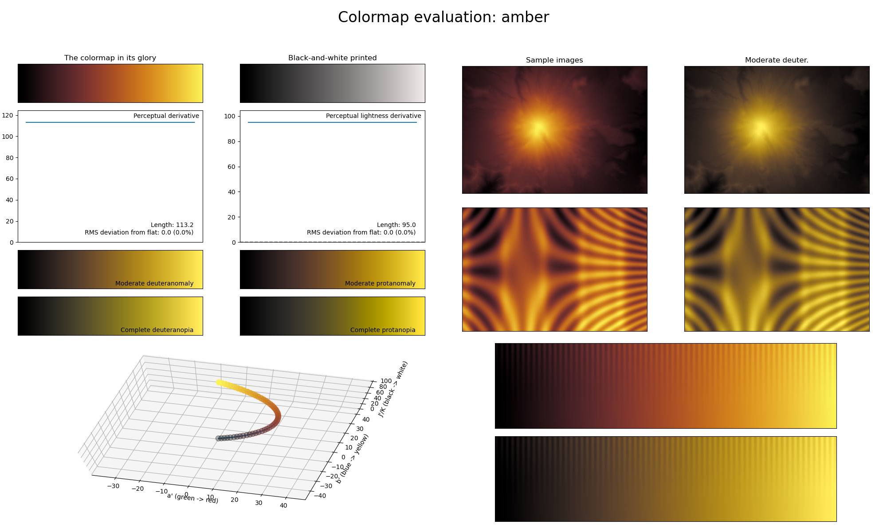

.. _amber:

amber
-----

The *amber* colormap is a visual representation of the gemstone with the same name.
It covers almost the full lightness range (:math:`[0, 95]`) and uses the color orange/yellow.
Its smoothly varying colors make it great for representing smooth information.
