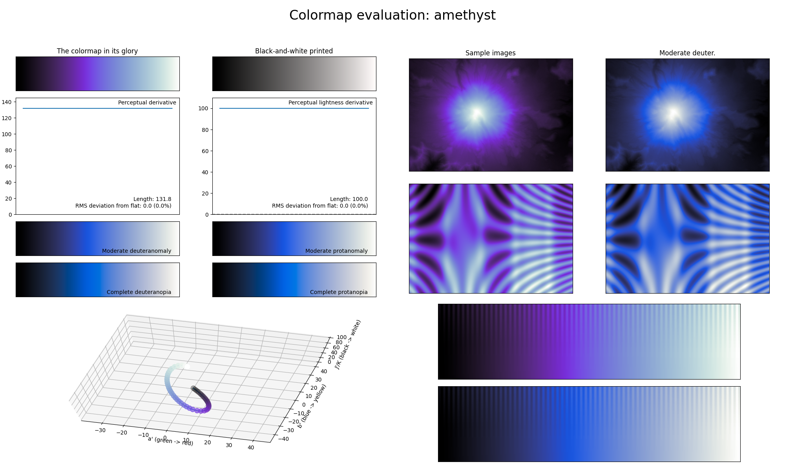

.. _amethyst:

amethyst
--------

The *amethyst* colormap is a visual representation of the gemstone with the same name.
It covers the full lightness range and primarily uses the color purple.
As with other single major color colormaps, it is great at representing smooth information.
