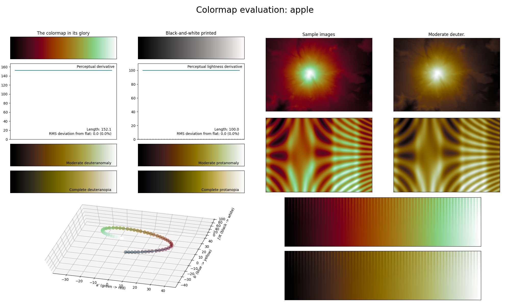

.. _apple:

apple
-----

The *apple* colormap is a visual representation of the fruit with the same name, in particular an `Elstar <https://en.wikipedia.org/wiki/Elstar>`_ apple.
It covers the full lightness range and uses the colors red and green.
Its bright colors near the maximum make it great for representing information where higher values should be the main focus.
Despite *apple* using red and green, the colors are far enough apart from each other to still be relatively CVD-friendly.
