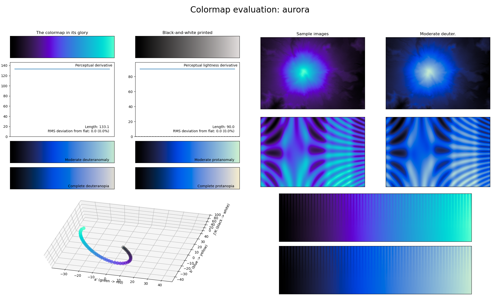

.. _aurora:

aurora
------

The *aurora* colormap is a visual representation of the natural light display phenomenon with the same name, in particular the rarer blue version.
It covers almost the full lightness range (:math:`[0, 90]`) and uses several shades of blue.
As with other colormaps that only use a single color, this colormap is great for representing smooth information.