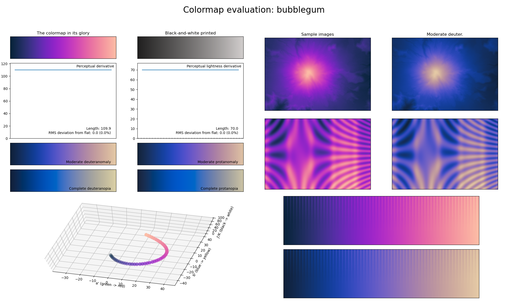

.. _bubblegum:

bubblegum
---------

The *bubblegum* colormap is a visual representation of the candy with the same name.
It covers the special :math:`[15, 85]` lightness range and uses the colors purple and pink.
Due to its low perceptual range and unique lightness range, *bubblegum* is excellent for representing discrete information and can easily be annotated over.
