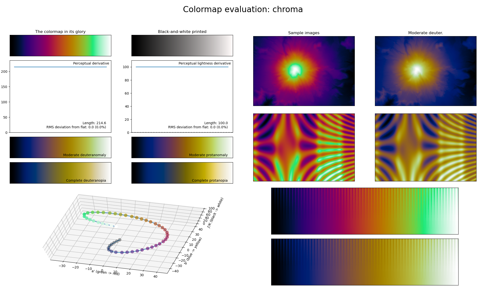

.. _chroma:

chroma
------

The *chroma* colormap is a visual representation of all major colors.
It covers the full lightness range and shows all major colors in roughly equal ratio.
Because it uses all major colors, this colormap has a very high perceptual range, making it excellent for representing information where small adjacent differences should be clearly visible.
It is also great in combination with the :func:`~cmasher.take_cmap_colors` function for picking distinguishable line colors.
Keep in mind that the *chroma* colormap is not as CVD-friendly as the other colormaps.
