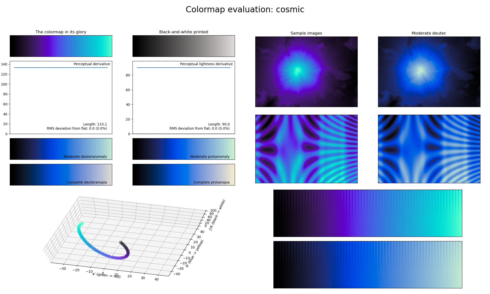

.. _cosmic:

cosmic
------
.. image:: ../../../../src/cmasher/colormaps/cosmic/cosmic.png
    :alt: Visual representation of the *cosmic* colormap.
    :width: 100%
    :align: center

The *cosmic* colormap is a visual representation of the cosmos, with the black/purple representing the vast emptiness of space and the purple/blue the bright stars and galaxies.
It covers almost the full lightness range (:math:`[0, 90]`) and uses several shades of blue.
As with other colormaps that only use a single color, this colormap is great for representing smooth information.
