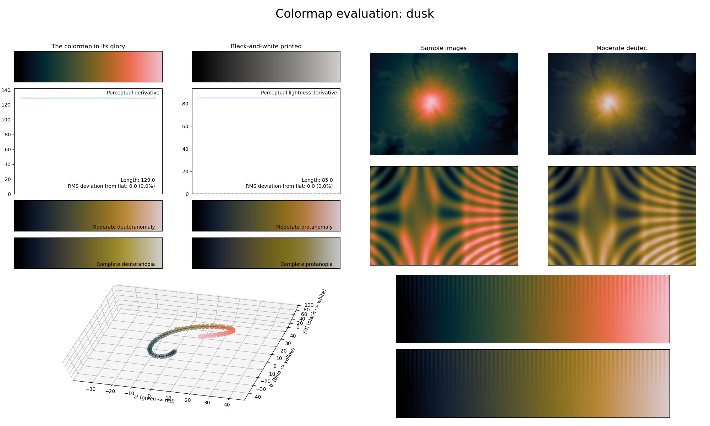

.. _dusk:

dusk
----
.. image:: ../../../../src/cmasher/colormaps/dusk/dusk.png
    :alt: Visual representation of the *dusk* colormap.
    :width: 100%
    :align: center

The *dusk* colormap is a visual representation of what the sky looks like during dusk (with the black/blue representing the dark sky and the orange/red the last few sunrays above the horizon).
It covers the :math:`[0, 85]` lightness range and has the colors blue and orange as its main colors.
It features a greyish area in the middle, making it great for representing ordered information where the extremes should be the main focus of the image.
