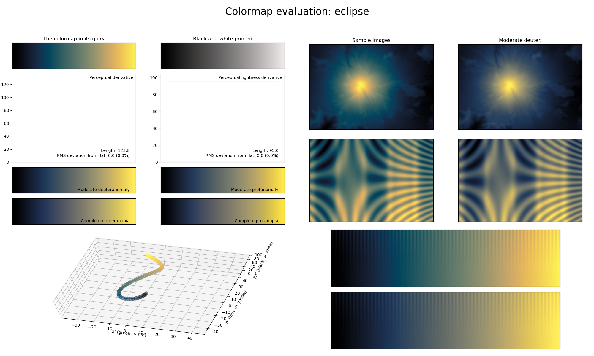

.. _eclipse:

eclipse
-------
.. image:: ../../../../src/cmasher/colormaps/eclipse/eclipse.png
    :alt: Visual representation of the *eclipse* colormap.
    :width: 100%
    :align: center

The *eclipse* colormap is a visual representation of a solar eclipse (with the black/blue representing the Moon and the yellow the Sun's corona).
It covers almost the full lightness range (:math:`[0, 95]`) and uses the colors blue and yellow.
It is excellent for representing information where the upper half should be the focus.
