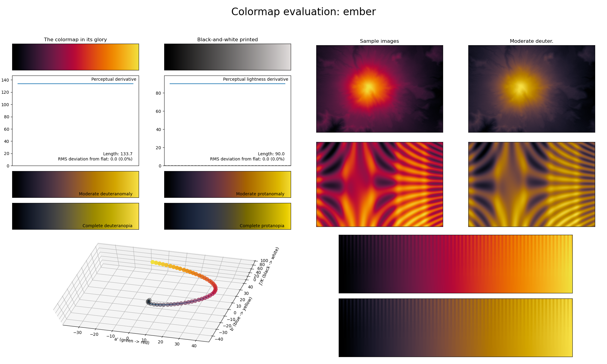

.. _ember:

ember
-----

The *ember* colormap is a visual representation of coal embers.
It covers almost the full lightness range (:math:`[0, 90]`) and uses the colors red and yellow.
As with some other colormaps in *CMasher*, its smoothly varying colors make it a good choice for representing intensity maps.
