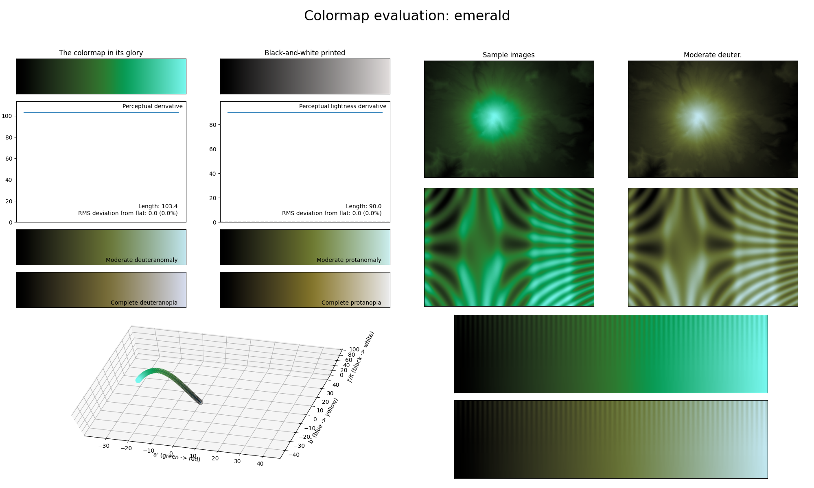

.. _emerald:

emerald
-------

The *emerald* colormap is a visual representation of the gemstone with the same name.
It covers the :math:`[0, 90]` lightness range and solely uses the color green-blue.
As with other single-major color colormaps, *emerald* is excellent for representing smooth data.
