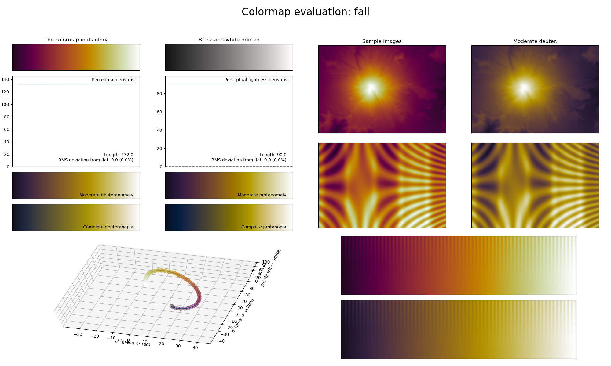

.. _fall:

fall
----

The *fall* colormap is a visual representation of the season with the same name, in particular its characteristic leaf colors.
It covers the :math:`[10, 100]` lightness range and uses the colors red and yellow.
Its calming colors make it great for representing background information in a plot or temperature scales.
Note that *fall* does not start at :math:`0` lightness, unlike most other colormaps in *CMasher*.
