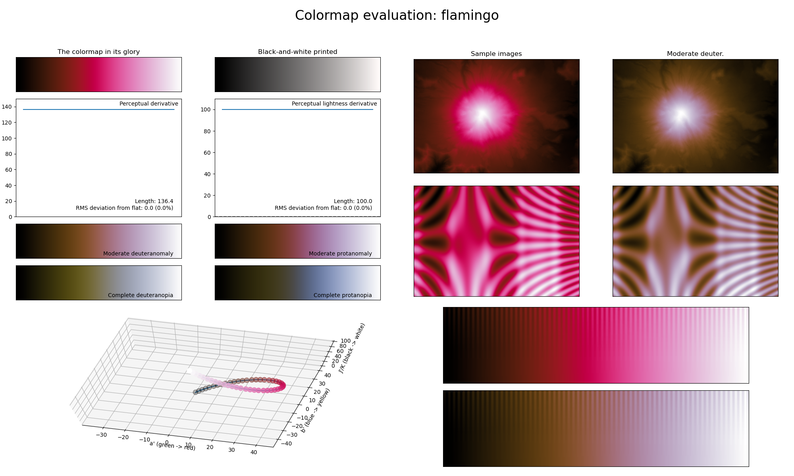

.. _flamingo:

flamingo
--------

The *flamingo* colormap is a visual representation of the bird with the same name.
It covers the full lightness range and solely uses the color red.
It is the most useful for representing information where the center should be the main focus, but is also great for smoothly varying information.
