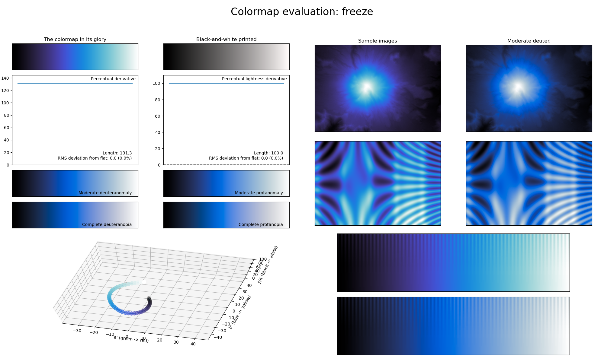

.. _freeze:

freeze
------

The *freeze* colormap is one of the two main colormaps used in `PRISM`_, and is a visual representation of a large body of water freezing over.
It covers the full lightness range and solely uses the color blue.
As it only uses a single color, this colormap is excellent for representing information that varies smoothly, like density/intensity values in a scientific plot.

.. _PRISM: https://github.com/1313e/PRISM
