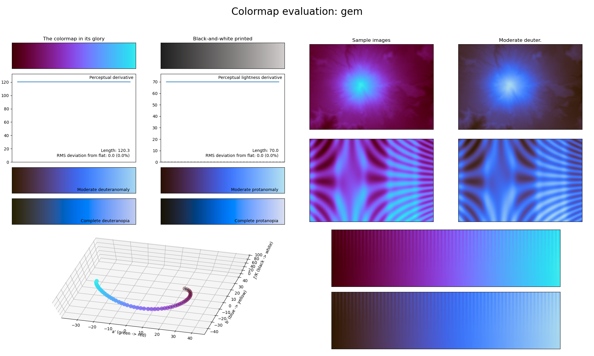

.. _gem:

gem
---

The *gem* colormap is a visual representation of the amethyst and aquamarine gemstones.
It covers the special :math:`[15, 85]` lightness range and uses the colors purple and blue.
Its very distinctive colors make it useful for representing dense information while not overloading on distractive colors, while also being easy to annotate over.
