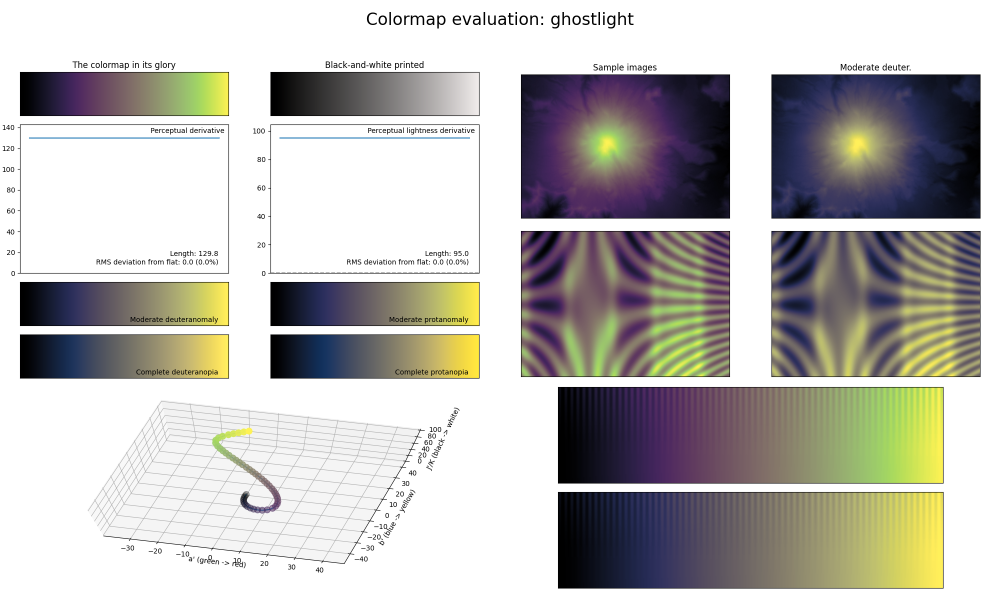

.. _ghostlight:

ghostlight
----------

The *ghostlight* colormap is a visual representation of the lanterns you expect to find in haunted houses (either in real-life or in videogames).
It covers almost the entire lightness range (:math:`[0, 95]`) and uses the colors purple and green-yellow.
Similarly to :ref:`eclipse`, it is excellent for representing information where the upper half should be the focus.
