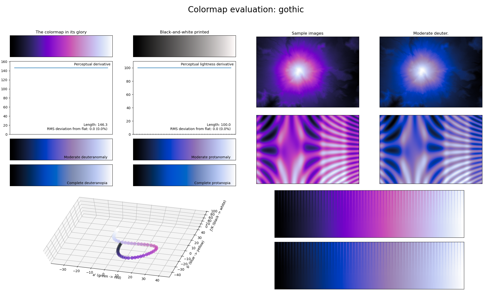

.. _gothic:

gothic
------

The *gothic* colormap is a visual representation of the stereotypical gothic colors.
It covers the full lightness range and solely uses the color purple.
As with the :ref:`freeze` colormap, this colormap is excellent for representing information that varies smoothly.
