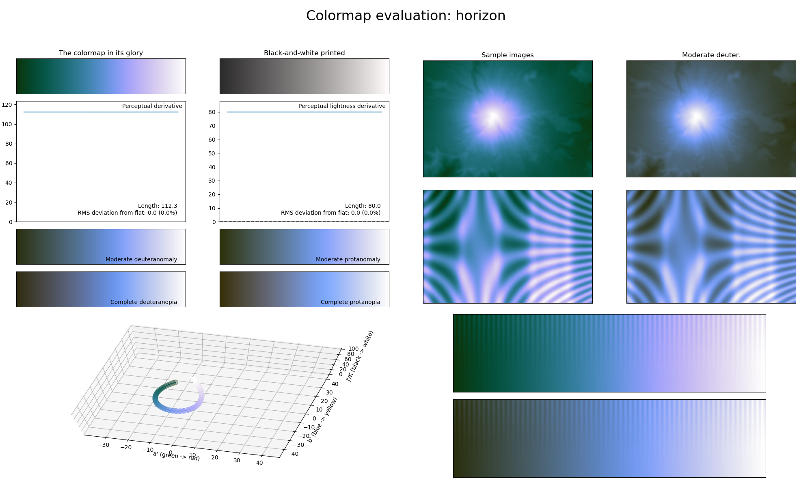

.. _horizon:

horizon
-------

The *horizon* colormap is a visual representation of the horizon, from the green colors of the land to the calm colors of the clouds.
It covers the :math:`[20, 100]` lightness range and has the colors green and blue as its main colors.
Similarly to :ref:`ocean`, this colormap is great for representing background information.
Also note that, like :ref:`ocean`, *horizon* does not start at :math:`0` lightness.
