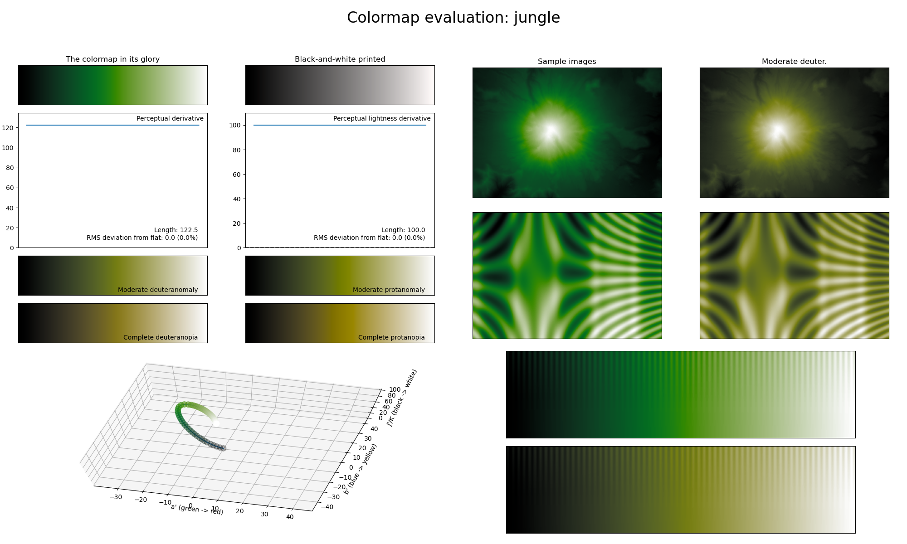

.. _jungle:

jungle
------

The *jungle* colormap is a visual representation of a jungle.
It covers the full lightness range and solely uses the color green.
As with the other single-color colormaps, this colormap is excellent for representing smooth information.
